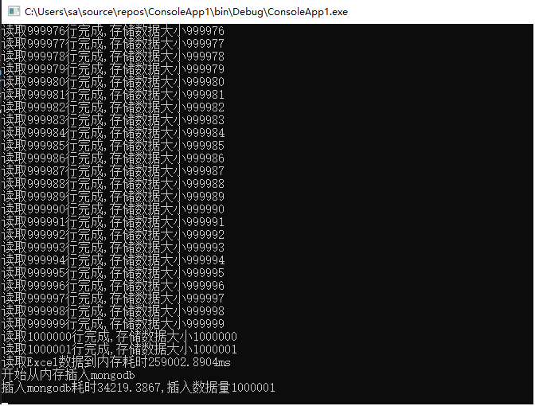

### 大数据Excel的读取
Open XML SDK 提供两种分析 Open XML 文件的方法。 可以使用 SDK 文档对象模型 (DOM) 或 Simple API for XML (SAX) 读取和写入功能。 SDK DOM 设计为使您可以使用强类型类轻松查询和分析 Open XML 文件。 但是，DOM 方法需要将整个 Open XML 部件加载到内存中，这在处理较大文件时会引发内存不足异常。 使用 SAX 方法，可以通过 OpenXMLReader 一次一个元素地读取文件中的 XML，而无需将整个文件加载到内存中。 当需要处理非常大的文件时，可考虑使用 SAX。

### c#调用Open XML SDK读取Excel
Excel数据100W行，读取方法如下

```
public class ExcelHelper
{

    /// <summary>
    /// 列名集合
    /// </summary>
    List<string> ListColumn = new List<string>();
    List<Dictionary<string, string>> ListDicDoc = new List<Dictionary<string, string>>();
    Dictionary<string, string> DicDoc = new Dictionary<string, string>();


    String GetCellValue(WorkbookPart workbookPart, Cell c)
    {
        string cellValue;
        if (c.DataType != null && c.DataType == CellValues.SharedString)
        {
            SharedStringItem ssi = workbookPart.SharedStringTablePart.SharedStringTable.Elements<SharedStringItem>().ElementAt(int.Parse(c.CellValue.InnerText));
            cellValue = ssi.Text.Text;
        }
        else
        {
            cellValue = c.CellValue.InnerText;
        }
        return cellValue;
    }

    Boolean StoreProductObject(OpenXmlReader reader, WorkbookPart workbookPart, bool isColumn)
    {
        reader.ReadFirstChild();
        if (reader.ElementType != typeof(Cell))
        {
            return false;
        }
        DicDoc.Clear();
        Cell c = (Cell)reader.LoadCurrentElement();

        var columnName = GetCellValue(workbookPart, c);
        if (isColumn)
        {
            ListColumn.Add(columnName);
        }
        else
        {
            DicDoc.Add(ListColumn[0], columnName);
        }

        int i = 1;
        while (reader.ReadNextSibling())
        {
            c = (Cell)reader.LoadCurrentElement();
            columnName = GetCellValue(workbookPart, c);
            if (isColumn)
            {
                ListColumn.Add(columnName);
            }
            else
            {
                DicDoc.Add(ListColumn[i], columnName);
            }
            i++;
        }
        ListDicDoc.Add(DicDoc);
        return true;
    }
    public void ReadAllCellValues(string fileName)
    {
        try
        {
            bool isHeader = true;
            using (SpreadsheetDocument spreadsheetDocument = SpreadsheetDocument.Open(fileName, false))
            {
                WorkbookPart workbookPart = spreadsheetDocument.WorkbookPart;
                foreach (WorksheetPart worksheetPart in workbookPart.WorksheetParts)
                {
                    isHeader = true;
                    int i = 0;
                    OpenXmlReader reader = OpenXmlReader.Create(worksheetPart);
                    while (reader.Read())
                    {
                        if (reader.ElementType == typeof(Row))
                        {
                            //第一行  默认为header
                            if (isHeader)
                            {
                                StoreProductObject(reader, workbookPart, isHeader);
                                isHeader = false;
                            }
                            else
                            {
                                StoreProductObject(reader, workbookPart, isHeader);
                            }
                            i++;
                            Console.WriteLine("读取{0}行完成,存储数据大小{1}", i.ToString(), ListDicDoc.Count().ToString());

                        }
                    }
                }
            }
        }
        catch (Exception)
        {

            throw;
        }
    }
}
```
耗时数据统计


* 优化

上述代码26行改为如下
```
LinkedList<Dictionary<string, string>> ListDicDoc = new LinkedList<Dictionary<string, string>>();
```
80行改为如下
```
ListDicDoc.AddLast(DicDoc);
```
ReadAllCellValues方法里的try---catch去掉

耗时数据统计


### 100w数据插入Mongodb
如上我们把内存中的listDicDoc插入Mongodb中,耗时如图


