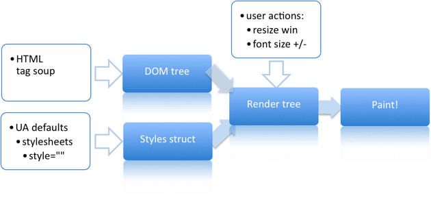

## 1、网页生成的过程

网页的生成过程，大致可以分为五部。
```
    1、HTML转化为DOM
    2、CSS代码转化成CSSDOM(CSS Object Model)
    3、结合DOM和CSSDOM,生成一颗渲染树(包含每个节点的视觉信息)
    4、生成布局(layout)，即将所有渲染树的所有节点进行平面合成
    5、将布局绘制(paint)在屏幕上
```
**上述过程大概就是：DOM树->样式树->渲染树->布局->绘制**

**布局(layout)和绘制(paint)合成为渲染**


**重新渲染就是重新布局(layout)和重新绘制(paint),前者叫做"重排(reflow)"，后者叫做"重绘"(repaint)**

### 重排的情况
* dom节点的删除、添加
* dom节点的宽高变化

**"重绘"不一定重排，重排必然导致重绘**

## 2、对于性能的影响
**提高网页性能，就是要降低"重排"和"重绘"的频率和成本，尽量少的触发重新渲染,尤其是重排**

一般的规则是
* 重排和重绘的DOM元素层级越高,成本就越高
* table元素的重排和重绘成本，高于div元素
## 3、提高性能的九个技巧
* DOM读写操作不要放在一起
```
// bad
div.style.left = div.offsetLeft + 10 + "px";
div.style.top = div.offsetTop + 10 + "px";

// good
var left = div.offsetLeft;
var top  = div.offsetTop;
div.style.left = left + 10 + "px";
div.style.top = top + 10 + "px"
```
* 如果某个样式是通过重排得到的，最好缓存结果。避免下一次用到的时候，浏览器又要重排
* 不要一条条的改变样式，而要通过class，或者csstext属性,一次性地改变
```
// bad
var left = 10;
var top = 10;
el.style.left = left + "px";
el.style.top  = top  + "px";

// good 
el.className += " theclassname";

// good
el.style.cssText += "; left: " + left + "px; top: " + top + "px;";
```
* 尽量使用离线DOM，而不是真实的网面DOM，来改变元素样式。比如，操作Document Fragment对象，完成后再把这个对象加入DOM。再比如，使用 cloneNode() 方法，在克隆的节点上进行操作，然后再用克隆的节点替换原始节点。
* 先将元素设为display: none（需要1次重排和重绘），然后对这个节点进行100次操作，最后再恢复显示（需要1次重排和重绘）。这样一来，你就用两次重新渲染，取代了可能高达100次的重新渲染。
* position属性为absolute或fixed的元素，重排的开销会比较小，因为不用考虑它对其他元素的影响。
* 只在必要的时候，才将元素的display属性为可见，因为不可见的元素不影响重排和重绘。另外，visibility : hidden的元素只对重绘有影响，不影响重排。
* 使用虚拟DOM的脚本库，比如React等。
* 使用 window.requestAnimationFrame()、window.requestIdleCallback() 这两个方法调节重新渲染（此处不做介绍）。

## 4、javascript加载
浏览器在解析dom文档的时候，当遇到加载js的script标签，会下载然后堵塞当前文档的继续解析，直到下载完毕，才会继续解析，有时候我们需要异步加载js文件
* defer ie下专用 代码可以写在内部 dom解析完毕时执行

```
<script type="text/javascript" defer="defer">
    console.log("123");
</script>
```

* async w3c标准 只能加载外部脚本 加载完毕立刻执行

```
<script type="text/javascript" async="async"></script>
```

* 按需加载

```
//callback 传入函数引用   如function(){text()}
//利用对象["text"] 也可以，当然要求你的js 必须是一个对象的写法 
function loadScript(url, callback) {
    //异步执行
    var script = document.createElement("script");
    script.type = "text/javascript";
    //ie
    //script.readyState;
    if (script.readyState) {
        script.onreadystatechange = function () {
            if (script.readyState == "complete" ||
                script.readyState == "loaded") {
                callback();
            }
        }
    } else {
        //ie不好使
        script.onload = function () {
            callback();
        }
    }
    script.src = url;  //下载 放在这个位置比较好，如果网速够快 下载太快  有可能导致无法出发readystate改变。
    document.head.appendChild(script); //执行tool.js里面的方法
}

//调用
loadScript("tool.js",function(){
    test(); //tool.js中的方法
});
```

## 5、javascipt加载时间线

1、创建Document对象，开始解析web页面。这个阶段document.readyState="loading"
2、遇到link外部css，创建线程加载,并继续解析文档
3、遇到script外部js,并且没有设置async、defer,浏览器加载并阻塞，等待js加载完该脚本并且执行，然后继续解析文档
4、遇到外部js，并且有设置async、defer,浏览器创建线程加载，并继续解析文档，对于async属性的脚本，脚本加载完立即执行（异步禁止使用document.write（））
5、遇到img等，先正常解析dom结构，然后浏览器异步加载src，并继续解析文档
6、当文档解析完成,document.readyState="interactive"
7、文档解析完成后，所有设置又defer的脚本会按顺序执行
8、document对象触发DOMContentLoaded事件，这也标志着程序从同步执行阶段，转化为事件驱动阶段(只可以用addEventListener来绑定该事件)
9、当所有async的脚本加载完成并执行后、img等加载完成后，document.readyState="complete",windows对象触发load事件
10、从此，以异步响应方式处理用户输入、网络事件等.

```
//解析完就执行
$(document).ready(function(){

})
//加载完执行，在解析完之后  一般不推荐使用 一些特殊场景下使用
window.load=function(){

};
```