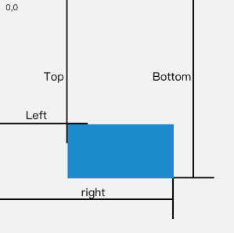
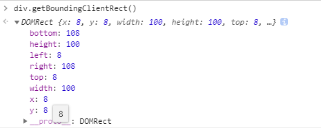

### 视口
在 PC 端，视口指的是浏览器的可视区域，其宽度和浏览器窗口的度保持一致。也可以叫可视区域。
浏览器存在滚动条，那么我们如何来求一个元素是否在可视区域呢，我们需要借助于Element.getBoundingClientRect()
其含义是返回元素的大小及其相对于视口的位置，如图



返回对象


首先我们获取可视区域
```
/**
获取视口
**/
function getViewportOffset() {
    if (window.innerWidth) {
        return {
            w: window.innerWidth,
            h: window.innerHeight
        }
    } else {
        if (document.compatMode == "BackCompat") {
            return {
                w: document.body.clientWidth,
                h: document.body.clientHeight
            }
        } else {
            return {
                w: document.documentElement.clientWidth,
                h: document.documentElement.clientHeight
            }
        }
    }
}
/**
判断是否在元素是否在是视口内
**/
function isElementInViewport(ele) {
    var vp = getViewportOffset() 
    var rect = ele.getBoundingClientRect();
    console.log("top:"+rect.top+",left:"+rect.left+",bottom:"+rect.bottom+",right:"+rect.right);
    return (
        rect.top >= 0 &&
        rect.left >= 0 &&
        rect.bottom <= vp.h &&
        rect.right <= vp.w
    );
}
```
### 自定义属性
Html5增加了一项新功能，也就是data-*自定义属性。貌似不对把。。。，这个本来不就是可以自定义属性，然后通过getAttribute来读取么，对，没问题，html5只是对其做了统一，并且读取data-*自定义属性也提供了新的接口

```
<div style="width: 100px;height:100px;background-color:red;" data-src="cs"></div>
<script>
   var div = document.getElementsByTagName("div")[0];
   var data = div.dataset.src;  //cs
</script>
```