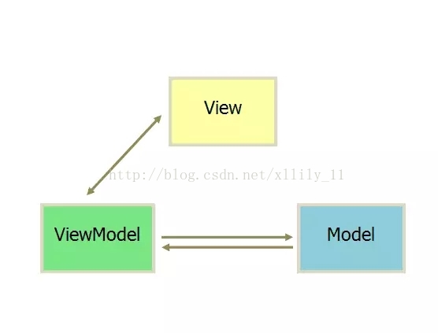
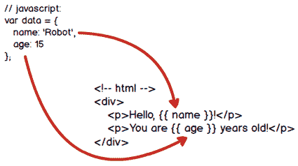
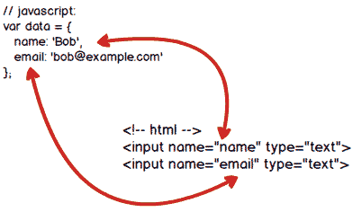

## 前端发展史

再谈为什么要用虚拟 DOM 之前,我们先了解下前端发展历史

* 最早的HTML页面是完全静态的网页,它们是预先编写好的存放在Web服务器上的html文件。浏览器请求某个URL时，Web服务器把对应的html文件扔给浏览器，就可以显示html文件的内容了


* 如果要针对不同的用户显示不同的页面，显然不可能给成千上万的用户准备好成千上万的不同的html文件，所以，服务器就需要针对不同的用户，动态生成不同的html文件。一个最直接的想法就是利用C、C++这些编程语言，直接向浏览器输出拼接后的字符串。这种技术被称为CGI：Common Gateway Interface。


* 很显然，像新浪首页这样的复杂的HTML是不可能通过拼字符串得到的。于是，人们又发现，其实拼字符串的时候，大多数字符串都是HTML片段，是不变的，变化的只有少数和用户相关的数据，所以，又出现了新的创建动态HTML的方式：ASP、JSP和PHP——分别由微软、SUN和开源社区开发。如:在ASP中，一个asp文件就是一个HTML，但是，需要替换的变量用特殊的``<%=var%>``标记出来了，再配合循环、条件判断，创建动态HTML就比CGI要容易得多

* 一旦浏览器显示了一个HTML页面，要更新页面内容，唯一的方法就是重新向服务器获取一份新的HTML内容。如果浏览器想要自己修改HTML页面的内容，就需要等到1995年年底，JavaScript被引入到浏览器。
  
    * js直接操作dom
    ```js
    var dom = document.getElementById('name');
    dom.innerHTML='Homer';
    ```
    * jQuery操作dom
    ```js
    $('#name').text('Homer').css('color', 'red');
    ```
* MVC模式，需要服务器端配合，JavaScript可以在前端修改服务器渲染后的数据,如asp.netMVC,我们用到的Razor标记,以及ajax动态拼接字符串配合js局部刷新展示等实现.

* MVVM框架模式
MVVM最早由微软提出来，它借鉴了桌面应用程序的MVC思想，在前端页面中，把Model用纯JavaScript对象表示，View负责显示，两者做到了最大限度的分离,把Model和View关联起来的就是ViewModel。ViewModel负责把Model的数据同步到View显示出来，还负责把View的修改同步回Model。
ViewModel如何编写？需要用JavaScript编写一个通用的ViewModel，这样，就可以复用整个MVVM模型了。

我们把变量``person``看作Model，把HTML某些DOM节点看作View，并意淫它们之间被关联起来了
这个时候我们只需要操作Model就可以了,如
改变JavaScript对象的状态，会导致DOM结构作出对应的变化！这让我们的关注点从如何操作DOM变成了如何更新JavaScript对象的状态，而操作JavaScript对象比DOM简单多了
这就是MVVM的设计思想：关注Model的变化，让MVVM框架去自动更新DOM的状态，从而把开发者从操作DOM的繁琐步骤中解脱出来
```js
//js
var person = {
    name: 'Bart',
    age: 12
};
//html
<p>Hello, <span id="name">Bart</span>!</p>
<p>You are <span id="age">12</span>.</p>

person.name = 'Homer';
person.age = 51;
//此处变化,对应的view就会改变

```

## 主流的MVVM框架

1. Angular:由Misko Hevery 等人创建，后为Google所收购
2. React:起源于 Facebook
3. Value:是由Google的核心开发工程师——尤雨溪（Evan You）所创建的框架

我们此处使用Vue2.0作为示例

## 解惑
1. 为什么要学习vue？
    1) 降低项目的复杂度
    2) 就业需要
2. vue难不难？
    特别简单

3. 相比于React，vue有什么优势？
   前端三大框架：Angular、React、Vue
   Vue的优势：
   1） 学习成本低
   2） Vue已经自动对执行效率进行了优化，初学者完全不用考虑效率问题
4. vue的特点
    1) 渐进式：vue的侵入性很少，可以与很多其他前端技术联用
    2) 组件化：针对复杂的页面,每个区域可以单独作为一个组件.(后面我们会细说)
    3) 响应式：数据响应式，vue会监控数据的变化，当数据发生变化时，自动重新渲染页面


## 单项绑定

MVVM就是在前端页面上，应用了扩展的MVC模式，我们关心Model的变化，MVVM框架自动把Model的变化映射到DOM结构上，这样，用户看到的页面内容就会随着Model的变化而更新。

例如，我们定义好一个JavaScript对象作为Model，并且把这个Model的两个属性绑定到DOM节点上：

经过MVVM框架的自动转换，浏览器就可以直接显示Model的数据了:


主流的MVVM框架:


新建html页面,输入以下内容
```js
<!DOCTYPE html>
<html lang="en">

<head>
    <meta charset="UTF-8">
    <meta name="viewport" content="width=device-width, initial-scale=1.0">
    <meta http-equiv="X-UA-Compatible" content="ie=edge">
    <title>Document</title>
    <script src="https://code.jquery.com/jquery-3.4.1.js"></script>
    <script src="https://unpkg.com/vue@2.0.1/dist/vue.js"></script>
    <script>
        // 初始化代码:
        $(function () {
            var vm = new Vue({
                el: '#vm',
                data: {
                    name: 'Robot',
                    age: 15
                }
            });
            window.vm = vm;
        });
    </script>
</head>
<body>
    <div id="vm">
        <p>Hello, {{ name }}!</p>
        <p>You are {{ age }} years old!</p>
    </div>
    
</body>
</html>
```
要特别注意的是，在``<head>``内部编写的JavaScript代码，需要用jQuery把MVVM的初始化代码推迟到页面加载完毕后执行，否则，直接在``<head>``内执行MVVM代码时，DOM节点尚未被浏览器加载，初始化将失败。
其中，el指定了要把Model绑定到哪个DOM根节点上,在该节点以及该节点内部，就是Vue可以操作的View。Vue可以自动把Model的状态映射到View上，但是不能操作View范围之外的其他DOM节点。

## 双向绑定

有单向绑定，就有双向绑定。如果用户更新了View，Model的数据也自动被更新了，这种情况就是双向绑定。
当用户填写表单时，View的状态就被更新了，如果此时MVVM框架可以自动更新Model的状态，那就相当于我们把Model!和View做了双向绑定：

在浏览器中，当用户修改了表单的内容时，我们绑定的Model会自动更新：


此处我们列举一些常用的双向绑定

### 文本框绑定
```js
//js
$(function () {
    var vm = new Vue({
        el: '#vm',
        data: {
            email: '',
            name: ''
        }
    });
    window.vm = vm;
});
//html
<form id="vm" action="#">
    <p><input v-model="email"></p>
    <p><input v-model="name"></p>
</form>
```
我们在表单改变的时候,打开控制台,``vm.name``便可以看到对应的model发生了改变,``vm.name=123``,便可以看到表单发生了变化

### checkbox绑定

```js
//Model
$(function () {
    var vm = new Vue({
        el: '#vm',
        data: {
            language: ['zh', 'en']
        }
    });
    window.vm = vm;
});
//html
<label><input type="checkbox" v-model="language" value="zh"> Chinese</label>
<label><input type="checkbox" v-model="language" value="en"> English</label>
<label><input type="checkbox" v-model="language" value="fr"> French</label>
```
操作language即可改变页面的选中状态,操作页面选中状态,即可改变language的值,如果单个checkbox直接model绑定为``true/false``

### select绑定
```js
//js
$(function () {
    var vm = new Vue({
        el: '#vm',
        data: {
            city: 'bj'
        }
    });
    window.vm = vm;
});
//html
<select v-model="city">
    <option value="bj">Beijing</option>
    <option value="sh">Shanghai</option>
    <option value="gz">Guangzhou</option>
</select>
```

## 处理事件
```js
//js
$(function () {
    var vm = new Vue({
        el: '#vm',
        data: {
            email: '',
            name: '',
            language: ['zh', 'en'],
            city: 'bj'
        },
        methods: {
            register: function () {
                // 显示JSON格式的Model:
                alert(JSON.stringify(this.$data));
                // TODO: AJAX POST...
            }
        }
    });
    window.vm = vm;
});
//html
<form id="vm" action="#" v-on:submit.prevent="register">
    <p><input v-model="email"></p>
    <p><input v-model="name"></p>
    <label><input type="checkbox" v-model="language" value="zh"> Chinese</label>
    <label><input type="checkbox" v-model="language" value="en"> English</label>
    <label><input type="checkbox" v-model="language" value="fr"> French</label>
    <select v-model="city">
        <option value="bj">Beijing</option>
        <option value="sh">Shanghai</option>
        <option value="gz">Guangzhou</option>
    </select>
    <button type="submit">btn</button>
</form>
```
``v-on:submit="register"``指令就会自动监听表单的``submit``事件，并调用register方法处理该事件。使用.prevent表示阻止事件冒泡，这样，浏览器不再处理``<form>``的submit事件。

## 声明周期钩子
每个 Vue 实例在被创建时都要经过一系列的初始化过程,同时也会调用响应的声明周期钩子,我们可以利用这些钩子,再合适的时机执行我们的业务逻辑.
* beforeCreate:创建前,``$el、$data``都为undefined
* created:创建完,``$el``为undefined,``$data``被初始化
* beforeMount:挂载前,``$el``被初始化
* mounted:挂载完,``$el``被初始化
* beforeUpdate:更新前,``dom``的状态
* updated:更新后``dom``的状态
* beforeDestroy:``vm.$destroy()``被调用,解除绑定及监听之前调用
* destroyed:销毁完毕调用
```js

//html
 <div id="app">
        <p>{{ message }}</p>
</div>
//js
var app = new Vue({
    el: '#app',
    data: {
        message: "xuxiao is boy"
    },
    beforeCreate: function () {
        console.group('beforeCreate 创建前状态===============》');
        console.log("%c%s", "color:red", "el     : " + this.$el); //undefined
        console.log("%c%s", "color:red", "data   : " + this.$data); //undefined 
        console.log("%c%s", "color:red", "message: " + this.message)
    },
    created: function () {
        console.group('created 创建完毕状态===============》');
        console.log("%c%s", "color:red", "el     : " + this.$el); //undefined
        console.log("%c%s", "color:red", "data   : " + this.$data); //已被初始化 
        console.log("%c%s", "color:red", "message: " + this.message); //已被初始化
    },
    beforeMount: function () {
        console.group('beforeMount 挂载前状态===============》');
        console.log("%c%s", "color:red", "el     : " + (this.$el)); //已被初始化
        console.log(this.$el);
        console.log("%c%s", "color:red", "data   : " + this.$data); //已被初始化  
        console.log("%c%s", "color:red", "message: " + this.message); //已被初始化  
    },
    mounted: function () {
        console.group('mounted 挂载结束状态===============》');
        console.log("%c%s", "color:red", "el     : " + this.$el); //已被初始化
        console.log(this.$el);
        console.log("%c%s", "color:red", "data   : " + this.$data); //已被初始化
        console.log("%c%s", "color:red", "message: " + this.message); //已被初始化 
    },
    beforeUpdate: function () {
        console.group('beforeUpdate 更新前状态===============》');
        console.log("%c%s", "color:red", "el     : " + this.$el);
        console.dir(this.$el.innerHTML);
        console.log("%c%s", "color:red", "data   : " + this.$data);
        console.log("%c%s", "color:red", "message: " + this.message);
    },
    updated: function () {
        console.group('updated 更新完成状态===============》');
        console.log("%c%s", "color:red", "el     : " + this.$el);
        console.dir(this.$el.innerHTML);
        console.log("%c%s", "color:red", "data   : " + this.$data);
        console.log("%c%s", "color:red", "message: " + this.message);
    },
    beforeDestroy: function () {
        console.group('beforeDestroy 销毁前状态===============》');
        console.log("%c%s", "color:red", "el     : " + this.$el);
        console.log(this.$el);
        console.log("%c%s", "color:red", "data   : " + this.$data);
        console.log("%c%s", "color:red", "message: " + this.message);
    },
    destroyed: function () {
        console.group('destroyed 销毁完成状态===============》');
        console.log("%c%s", "color:red", "el     : " + this.$el);
        console.log(this.$el);
        console.log("%c%s", "color:red", "data   : " + this.$data);
        console.log("%c%s", "color:red", "message: " + this.message)
    }
})
```

## 同步DOM结构
MVVM还有一个重要的用途，就是让Model和DOM的结构保持同步

```js
// 初始化代码:
$(function () {
    var vm = new Vue({
        el: '#vm',
        data: {
            title: 'TODO List',
            todos: [
                {
                    name: 'Learn Git',
                    description: 'Learn how to use git as distributed version control'
                },
                {
                    name: 'Learn JavaScript',
                    description: 'Learn JavaScript, Node.js, NPM and other libraries'
                },
                {
                    name: 'Learn Python',
                    description: 'Learn Python, WSGI, asyncio and NumPy'
                },
                {
                    name: 'Learn Java',
                    description: 'Learn Java, Servlet, Maven and Spring'
                }
            ]
        }
    });
    window.vm = vm;
});
//html
<div id="vm">
    <h3>{{ title }}</h3>
    <ol>
        <li v-for="t in todos">
            <dl>
                <dt>{{ t.name }}</dt>
                <dd>{{ t.description }}</dd>
            </dl>
        </li>
    </ol>
</div>
```
``v-for``指令把数组和一组``<li>``元素绑定了。在``<li>``元素内部，用循环变量t引用某个属性，例如，``{{ t.name }}``。这样，我们只关心如何更新Model，不关心如何增删DOM节点，大大简化了整个页面的逻辑
需要注意的是，Vue之所以能够监听Model状态的变化，是因为JavaScript语言本身提供了Proxy或者Object.observe()机制来监听对象状态的变化。但是，对于数组元素的赋值，却没有办法直接监听

## 虚拟DOM

### 虚拟DOM的由来

* 刚开始的View-Model即始终整体“刷新”页面,这种方式虽然简单粗暴，但是很明显的缺点，就是很慢。
* 那么我们必须进行比较,对于没有改变的 DOM 节点，让它保持原样不动，仅仅创建并替换变更过的 DOM 节点.DOM 是树形结构，所以 diff 算法必须是针对树形结构的。目前已知的完整树形结构 diff 算法复杂度为 O(n^3)
* DOM 是复杂的,仅创建一个空白的 div，其实例属性就达到 251 个
```js
    //microsoft edge 79
    const div = document.createElement('div');
    let m = 0;
    for (let k in div) {
        m++;
    }
    console.log(m); // 251
```
    对于 DOM 这么多属性，其实大部分属性对于做 Diff 是没有任何用处的，所以如果用更轻量级的 JS 对象来代替复杂的 DOM 节点，然后把对 DOM 的 diff 操作转移到 JS 对象，就可以避免大量对 DOM 的查询操作。这个更轻量级的 JS 对象就称为 Virtual DOM 。
    那么现在的过程就是这样：
  1. 维护一个使用 JS 对象表示的 Virtual DOM，与真实 DOM 一一对应
  2. 对前后两个 Virtual DOM 做 diff ，生成变更（Mutation）
  3. 把变更应用于真实 DOM，生成最新的真实 DOM

目前市场是流行的React、Vue,内部实现核心是虚拟DOM的实现和虚拟DOM树之间的比较算法


### 虚拟DOM的性能

传统前端的编程方式是命令式的，直接操纵 DOM，告诉浏览器该怎么干。这样的问题就是，大量的代码被用于操作 DOM 元素，且代码可读性差，可维护性低。

React 的出现，将命令式变成了声明式，摒弃了直接操作 DOM 的细节，只关注数据的变动，DOM 操作由框架来完成，从而大幅度提升了代码的可读性和可维护性。

虚拟 DOM 和 Diff 算法的出现是为了解决由命令式编程转变为声明式编程、数据驱动后所带来的性能问题的。换句话说，``直接操作 DOM 的性能并不会低于虚拟 DOM 和 Diff 算法，甚至还会优于。``

这么说的原因是因为 Diff 算法的比较过程，比较是为了找出不同从而有的放矢的更新页面。但是比较也是要消耗性能的。而直接操作 DOM 就是有的放矢，我们知道该更新什么不该更新什么，所以不需要有比较的过程。所以直接操作 DOM 效率可能更高。

React 厉害的地方并不是说它比 DOM 快，而是说不管你数据怎么变化，我都可以以最小的代价来进行更新 DOM。方法就是我在内存里面用新的数据刷新一个虚拟 DOM 树，然后新旧 DOM 进行比较，找出差异，再更新到 DOM 树上。

框架的意义在于为你掩盖底层的 DOM 操作，让你用更声明式的方式来描述你的目的，从而让你的代码更容易维护。没有任何框架可以比纯手动的优化 DOM 操作更快，因为框架的 DOM 操作层需要应对任何上层 API 可能产生的操作，它的实现必须是普适的。

### 虚拟DOM的作用

* Virtual DOM 在牺牲(牺牲很关键)部分性能的前提下，增加了可维护性，这也是很多框架的通性。
* 实现了对 DOM 的集中化操作，在数据改变时先对虚拟 DOM 进行修改，再反映到真实的 DOM 中，用最小的代价来更新 DOM，提高效率

### 虚拟DOM的缺点
* 首次渲染大量 DOM 时，由于多了一层虚拟 DOM 的计算，会比 innerHTML 插入慢。
* 虚拟 DOM 需要在内存中的维护一份 DOM 的副本
* 如果虚拟 DOM 大量更改，这是合适的。但是单一的，频繁的更新的话，虚拟 DOM 将会花费更多的时间处理计算的工作。所以，如果你有一个 DOM 节点相对较少页面，用虚拟 DOM，它实际上有可能会更慢。但对于大多数单页面应用，这应该都会更快。

### 总结
虚拟 DOM 最大的优势在于抽象了原本的渲染过程，实现了跨平台的能力，而不仅仅局限于浏览器的 DOM，可以是安卓和 IOS 的原生组件，可以是近期很火热的小程序，也可以是各种 GUI

### MVVM适用范围

新闻，博客、文档等，不能使用MVVM展示数据，因为这些页面需要被搜索引擎索引，而搜索引擎无法获取使用MVVM并通过API加载的数据。

需要SEO（Search Engine Optimization）的页面，不能使用MVVM展示数据。不需要SEO的页面，如果前端逻辑复杂，就适合使用MVVM展示数据

## 前导

此处我们所介绍的都是为了引出vue;可能只会片面的介绍.

**什么会影响web应用性能**

- 操作DOM

JS和 DOM是两种东西，每次连接都需要消耗性能
操作DOM会导致重排和重绘

vue的核心是虚拟dom，使用虚拟dom可以减少dom的操作，从而提升应用的性能

所谓虚拟dom，即为伪dom，假的dom，他不是一个真实的dom，而是由JS
来模拟出来的具有真实dom结构的一个树形结构

js模拟dom结构
```js
<div id="container">
    <h1 class="title">hello</h1>
    <p class="content">world</p>
</div>
<script>

    const vDom = {
        tag: "div",
        attrs: {
            id: 'container',
        },
        children: [
            {
                tag: "h1",
                attrs: {
                    class: 'title',
                    children: ['hello']
                }
            },
            {
                tag: 'p',
                attrs: {
                    class: 'content',
                },
                children: [
                    'world'
                ]
            }
        ]
    }
</script>
```

- 我们用JQ和vdom分别操作数据来看看效果
1. 利用JQ操作替换数据
```js
<ul id="container"></ul>
<button>更改职业</button>
<script src="https://cdn.bootcss.com/jquery/3.3.1/jquery.min.js"></script>
<script>
    const $container = $("#container");
    const $button = $('button');
    const dataList = [
        {
            name: 'shan',
            age: 18,
            profession: '讲师'
        },
        {
            name: 'jc',
            age: 22,
            profession: '自称华语最帅男讲师'
        },
        {
            name: 'cst',
            age: 20,
            profession: '从前是高瘦帅的，现在是胖讲师'
        },
        {
            name: 'dxm',
            age: 88,
            profession: '渡一教具，哪都有他'
        }
    ];

    function getData(dataList) {
        let liStr = '';

        dataList.forEach(item => {
            liStr += `<li>
                        <span>${item.name}</span>
                        <span>${item.age}</span>
                        <span>${item.profession}</span>
                    </li>`
        })

        $container.html(liStr);
    }
    getData(dataList);
    $button.on('click', () => {
        dataList[0].profession = '可能是宇宙最美讲师了';
        dataList[1].profession = '杉杉的擦桌工';
        dataList[2].profession = '杉杉的倒水工';
        dataList[3].profession = '杉杉的擦鞋工';
        getData(dataList);
    })

</script>
```
2. 利用vdom操作替换数据
我们这里用到snabbdom来实现dom的比对
```js
<ul id="container"></ul>
<button id="button">更改职业</button>
<script src="https://cdn.bootcss.com/snabbdom/0.7.2/snabbdom.js"></script>

<script>

    const oContainer = document.getElementById('container');
    const oButton = document.getElementById('button');
    const patch = snabbdom.init([]);
    const h = snabbdom.h;

    let vNode = null;
    const dataList = [
        {
            name: 'shan',
            age: 18,
            profession: '讲师'
        },
        {
            name: 'jc',
            age: 22,
            profession: '自称华语最帅男讲师'
        },
        {
            name: 'cst',
            age: 20,
            profession: '从前是高瘦帅的，现在是胖讲师'
        },
        {
            name: 'dxm',
            age: 88,
            profession: '渡一教具，哪都有他'
        }
    ];

    function getData(dataList) {
        const liArr = [];
        dataList.forEach(item => {
            const li = h('li', {}, [
                h('span', {}, [item.name]),
                h('span', {}, [item.age]),
                h('span', {}, [item.profession])
            ])
            liArr.push(li);
        });
        const newVNode = h('ul#container', {}, liArr);
        if (vNode) {
            patch(vNode, newVNode);
        } else {
            patch(oContainer, newVNode);
        }
        vNode = newVNode;
    }
    getData(dataList);
    oButton.onclick = function () {
        dataList[0].profession = '可能是宇宙最美讲师了';
        dataList[1].profession = '杉杉的擦桌工';
        dataList[2].profession = '杉杉的倒水工';
        dataList[3].profession = '杉杉的擦鞋工';
        getData(dataList);
    }
</script>
```

从以上我们可以看出,利用JQ操作会导致所有``li``重新绘制,vdom只会绘制改变的``span``

## 创建一个Vue实例

- 引入``vue.js``文件
```js
<script src="https://cdn.jsdelivr.net/npm/vue/dist/vue.js"></script>
```

- 创建vue实例``new Vue({})``

```js
const vm = new Vue({
    el: "#app",
    data: {
        name: '110laile',
        obj: {
            a: 1,
            b: 2
        },
        arr: [
            1, 2, 3
        ]
    }
})
```
``el``挂载管理的dom元素,``data``在dom元素里可以找到的变量

- 插值表达式 写在挂载dom元素中的js表达式

```js
{{ 'a' }}
//必须严格有空格
{{ {a:'1',b:'2'} }}
//三元表达式
{{ !true ? 'a':'b' }}
//此处name为vue实例中data存在的变量
{{ name }}
```
- 数据要先存在才会渲染视图
``obj.xxx=90``视图不会变化

- $set渲染视图
``vm.$set(obj,'xxx',90)``

- $el获取挂载的dom
``vm.$el.innerText``

- $nextTick dom元素渲染之后执行
```js
vm.$nextTick(() => {
    console.log(vm.$el.innerText);
})
```

- $mount挂载dom
- 数组操作
**通过索引的方式修改数组数据,不可以渲染视图**
**通过长度的方式修改数组数据,不可以渲染视图**
**数组变异方法 push、pop、shift、unshift、sort、reverse、splice 可以渲染视图**


## vue指令

- v-pre
写什么输出什么,不进行编译
```js
<div v-pre>
    {{ 'a' }}
</div>
//输出{{ 'a' }}
```

- v-cloak
当页面进来的时候先渲染页面,在渲染js,在js还没有执行的时候,页面上会还没有渲染数据,通过这个指令可以配合css使用,防止界面上出现为渲染的数据,当渲染了之后,会消除这个指令
```js
<style>
    [v-cloak] {
        display: none;
    }
</style>
<div v-cloak>
    {{ 'p' }}
</div>
```

- v-once
只会使用第一次的值,之后改变数据,不会在渲染了
```js
<div v-once>
    {{ name }}
</div>
```

- v-html
等效于innerHTML
```js
//dom:"<div>110laile</div>";
<div v-html="dom"></div>
```

- v-text
等效于innerText 会覆盖标签之间的数据,插值表达式会累加
```js
//name: '110'
<div v-text="name">
</div>
```

- v-if
template标签没有任何的意义,不会渲染到页面
```js
//flag:"0"
<template v-if="flag === 0">
    <div>123</div>
</template>
<template v-else-if="flag === 1">
    <div>789</div>
</template>
<template v-else>
    <div>456</div>
</template>
```

- v-show
控制display,v-if移除元素和添加元素 不支持template
```js
<div v-show="biaoji">
    halou
</div>
```

- v-bind
绑定属性,可以简写为``:``
```js

```
  - class
  []用来写多个class {}判断是否显示某个class
  ```js
  <div :class="[redClass,yellowClass]"></div>
  <div :class="{red:true,yellow:true}"></div>
  ```
  - style
  [] {} :style权重大于style 因为:style是后渲染的
  ```js
  //style: { width: `100px`, height: `100px`, backgroundColor: 'red' },
  //style1: { color: '#fff' },
  <div :style="{width:`100px`,height:`100px`,backgroundColor:redClass}"></div>
  <div :style=[style,style1]>i am div</div>
  ```

- v-on
绑定事件,简写为@,事件通常写在methods中,不过写在data中也可以,目前发现this指向不一样.事件不可以写箭头函数

- v-for
  - 循环数组
  ```js
  //arr:[1,2,3,4]
  <div v-for="(item,index) in arr" :key="item">
    {{item}}
  </div>
  ```
  - 循环对象
  ```js
  //person:{name:'11',age:18}
  <div v-for="(key,value) in person">
    {{ key }}---{{ value }}
  </div>
  ```
  - 循环数字
  ```js
  <div v-for="item in 8">
    {{ item }}
  </div>
  ```
  - 循环字符串
  ```js
  <div v-for="item in 'hello'">
    {{ item }}
  </div>
  ```
key值需要唯一,不要用index,key值的唯一性保证了在改变dom的时候尽可能的复用dom为了性能更好
1. 示例一
```js
<div v-for="item in students" :key="item.id">
    <span :_key="item.id">{{ item.name }}</span>
</div>
<button @click="reverse">反转</button>
//js
reverse() {
    this.students.reverse();
}
```
反转之后对应的dom节点都会复用,不会重新创建

2. 示例二
```js
<div v-if="flag">
    <label for="name">名字</label>
    <input type="text" id="name" key="name">
</div>
<div v-else>
    <label for="age">年龄</label>
    <input type="text" id="age" key="age">
</div>
<button @click="swi">切换</button>

swi() {
    this.flag = !this.flag;
}
```
加上key切换的时候就会调用对应的input,不加key就会用一个input,分不清到底是哪个input

- v-model
双向绑定 value+input语法糖
```js
<input type="text" value="name" @input="handle">
handle(e) {
    this.name = e.target.value;
}
```
  - input text
  ```js
  <input type="text" v-model="name">
  ```
  - input textarea
  ```js
  <input type="textarea" v-model="name">
  ```
  - input checkbox
  ```js
  //checked:false
  <input type="checkbox" v-model="checked">
  //checkedArr:[]
  <label for="a"></label>
  <input type="checkbox" v-model="checkedarr" id="a" value="aaa">
  <label for="b"></label>
  <input type="checkbox" v-model="checkedarr" id="b" value="bbb">
  <label for="c"></label>
  <input type="checkbox" v-model="checkedarr" id="c" value="ccc">
  ```
  - input radio
  ```js
  <label for="one">one</label>
  <input type="radio" id="one" v-model="picked" value="one">
  <label for="two">two</label>
  <input type="radio" id="two" v-model="picked" value="two">
  {{ picked }}
  ```
  - select
  ```js
  //selected:'A'
  <select v-model="selected">
        <option value="" disabled>请选择</option>
        <option value="A">A</option>
        <option value="B">B</option>
        <option value="C">C</option>
  </select>
  //selectedArr:[]
  <select v-model="selectedArr" multiple>
        <option value="A">A</option>
        <option value="B">B</option>
        <option value="C">C</option>
  </select>
  ```
- 自定义指令
  - 全局注册``Vue.directive()``
  ```js
   Vue.directive('slice', (el, bindings, vnode) => {
        let val = bindings.value.slice(0, 5);
        vnode.context[bindings.expression] = val;
   })
    Vue.directive('slice', {
        bind(el, bindings, vnode) {

        },
        update(el, bindings, vnode) {
            let val = bindings.value.slice(0, 5);
            vnode.context[bindings.expression] = val;
        },
        inserted(el) {
            el.focus();
        }
    })
  ```
  第一种写法等于第二种同时调用bind和update
  上述slice实现截取5个字符的长度,但是依赖vmodel,下面实现一个完整的slice
  ```js
  Vue.directive('slice', {
        bind(el, bindings, vnode) {
            const ctx = vnode.context;
            const length = bindings.arg || 5;
            const numberFlag = bindings.modifiers.number;
            let initValue = ctx[bindings.expression];
            el.oninput = (e) => {
                let value = e.target.value;
                if (numberFlag) {
                    value = value.replace(/[^0-9]/g, '');
                }
                let val = value.slice(0, length);
                ctx[bindings.expression] = val;
                el.value = val;
            }
            if (numberFlag) {
                initValue = initValue.replace(/[^0-9]/g, '');
            }
            el.value = initValue.slice(0, length);
            ctx[bindings.expression] = initValue.slice(0, length);
        },
        update(el, bindings, vnode) {
            let ctx = vnode.context;
            const numberFlag = bindings.modifiers.number;
            let value = ctx[bindings.expression];
            if (numberFlag) {
                value = value.replace(/[^0-9]/i, "");
            }
            el.value = value;
            ctx[bindings.expression] = value;
        },
        inserted(el) {
            el.focus();
        }
    })
  ```

  - 局部注册``directive:{}``
- filter 过滤器
不改变原值,只改变显示,可以局部注册,也可以全局注册
```js
//{{ money | toMoney(2) | ceshi }}
Vue.filter('toMoney', (value, times) => {
    return (value * times).toLocaleString();
});

Vue.filter('ceshi', value => {
    console.log(value);
    return value;
})
```

## el、template、render

render的优先级大于templated大于el


render中创建html元素
```js
render(h){
    return h('h1', {
    class: 'haha',
    style: {
        color: 'red',
        fontSize: '12px'
    }
    },[
    '我是一个h1标题',
    h('p', '我是一个p标签')
    ])
}
```

## 计算属性和侦听器

### 计算属性

计算属性相比方法会有缓存,只有依赖项发生改变才会重新调用,不然会调用缓存

- 对象写法
  ```js
  computed:{
     person: {
         get() {
             return this.name + '-' + this.age;
         },
         set(val) {
             this.name = '改变啦';
             this.age = '100'
         }
     },
  }
  ```
- 方法写法
  ```js
  computed:{
     person(){
         return this.name + '-' + this.age;
     }
  }
  ```

### 侦听器

computed不可执行异步，watch可执行异步。
computed可以观察多个数据，watch只观察一个。
computed可以新生成一个数据，直接在视图中渲染。watch不可，他用的是本身存在的数据。

- 对象写法
  ```js
  watch:{
    name:{
        handler(){
            this.person = this.name + '-' + this.age;
        },
        immediate:true
    },
    age:{
        handler(){
            this.person = this.name + '-' + this.age;
        },
        immediate:true
    }
  }
  ```
- 方法写法
  ```js
  watch:{
     name() {
         this.person = this.name + '-' + this.age;
     },
     age() {
         this.person = this.name + '-' + this.age;
     }
  }
  ```


## 组件

组件是页面中的一个可复用的功能单元

### 初识组件

组件的创建：组件对于开发者，是一个普通的配置对象，该配置对象几乎和之前学习的vue配置一致。

组件的注册：
1. 全局注册
2. 局部注册: 在使用的组件会vue实例配置中通过components注册
原则：除了全局通用的组件，并且经常用到的组件使用全局注册，否则尽量局部注册


组件名称的规范，以下命名方式任选其一：
1. 使用短横线命名
2. 大驼峰命名法


组件的使用：把组件当作标签使用即可，标签名任选其一
1. 短横线命名法
2. 大驼峰命名法

```js
const vm = new Vue({
    el: "#app",
    template:"<HelloWorld />",
    components: {
        HelloWorld: {
            template: "<div>helloworld</div>"
        }
    }
})
```

组件在Html中书写的话不可以大驼峰方式.

### 属性传递和属性校验

```js
const vm = new Vue({
    el: '#app',
    data: {
        title: '110来了',
        content: '测试'
    },
    template: `<MyContent :title="title" :content="content"  />`,
    components: {
        MyContent: {
            props: ['title', 'content'],
            template: `<div><h3>{{title}}</h3><p>{{content}}</p></div>`
        }

    }
})
```
通过props属性给组件添加属性,就可以把值传递过来了,有时候我们可以对传递的值需要一些校验,或者设置默认值

```js
props: {
    title: {
        type: Number,
        required: true,
    },
    content: {
        type: String,
        default: '默认值,不传递的时候使用'
    },
    arr: {
        type: Array,
        default: () => [1, 2, 3, 4]
    }
},
```
**注意如果是引用类的  默认值要用函数创建,不然复用多个组件会引用同一个对象**

### 组件通信
- $attrs
```js
const vm = new Vue({
    el: '#app',
    data: {
        title: '110来了',
        content: '测试'
    },
    template: `<MyContent :title="title" a="123" :content="content" />`,
    components: {
        MyContent: {
            props: ['title'],
            inheritAttrs: false,
            template: `<div>
                        <h3>{{title}}</h3>
                        <MyP v-bind="$attrs"/>
                        </div>`,
            components: {
                MyP: {
                    props: ['content'],
                    template: `<p>{{ content }}</p>`
                }
            }
        }
    }
})
```
``$attrs``会传递没有通过属性声明的属性,通过``v-bind``可以传递``$attrs``,``inheritAttrs``可以让传递的没有在组件内声明的属性不在行间显示.
- $parent、$children
```js
const vm = new Vue({
    el: '#app',
    data: {
        title: '110来了',
        content: '内容',
    },
    template: `<MyContent />`,
    components: {
        MyContent: {
            data() {
                return {
                    childrenContent: ""
                }
            },
            created() {
                this.title = this.$parent.title;
            },
            mounted() {
                this.childrenContent = this.$children[0].childrenContent;
            },
            template: `<div>
                        <h3>{{ title }}{{ childrenContent }}</h3>
                        <MyP />
                        </div>`,
            components: {
                MyP: {
                    data() {
                        return {
                            childrenContent: '我是孙子'
                        }
                    },
                    created() {
                        this.content = this.$parent.$parent.content;
                    },
                    template: `<p>{{ content }}</p>`
                }
            }
        }
    }
})
```
- provide
```js
const vm = new Vue({
    el: '#app',
    provide: {
        title: '110来了',
        content: '内容'
    },
    template: `<MyContent />`,
    components: {
        MyContent: {
            inject: ['title'],
            template: `<div>
                        <h3>{{ title }}</h3>
                        <MyP />
                    </div>`,
            components: {
                MyP: {
                    inject: ['content'],
                    template: `<p>{{ content }}</p>`
                }
            }
        }
    }
})
```
- $refs
```js
const vm = new Vue({
    el: '#app',
    template: `<MyCmp ref='cmp' />`,
    mounted() {
        console.log(this.$refs.cmp.msg);
    },
    components: {
        MyCmp: {
            data() {
                return {
                    msg: 'hello cmp'
                }
            },
            template: `<div>i am a cmp</div>`
        }
    }
})
```
- 通过事件传递
```js
const vm = new Vue({
    el: '#app',
    template: `<MyCmp @click="func" @like="like" />`,
    methods: {
        func(data) {
            console.log(data);
        },
        like() {
            console.log('自定义事件');
        }
    },
    components: {
        MyCmp: {
            props: ['func'],
            methods: {
                handleClick() {
                    //this.$listeners.click('cmp hello world');
                    this.$emit('click', 'cmp hello world');
                    this.$emit('like');
                }
            },
            template: `<div>
                        <button @click="handleClick">点击</button>
                        <button v-on="$listeners">click</button>
                        </div>`
        }
    }
})
```
``$listeners``可以调用组件上引用的事件,v-on可以调用所有系统事件,不会调用自定义事件,``$emit``和listeners类似
- 事件总线
```js
Vue.prototype.bus = new Vue();
const vm = new Vue({
    el: '#app',
    template:`<div><MyInput /> <MyContent /></div>`,
    components: {
        MyContent: {
            data() {
                return {
                    content: ""
                }
            },
            created() {
                this.bus.$on('click', content => {
                    this.content = content;
                })
            },
            template: `<div>{{content}}</div>`
        },
        MyInput: {
            data() {
                return {
                    inputVal: ""
                }
            },
            methods: {
                handleClick() {
                    this.bus.$emit('click', this.inputVal);
                },
            },
            template: `<div>
                            <input type="text" v-model.lazy="inputVal" />
                            <button @click="handleClick">提交</button>
                        </div>`
        }
    }
})
```
- 双向传输
```js
Vue.component("MyContent", {
    props: ['value'],
    mounted() {
        setInterval(() => {
            let value = this.value + 1;
            this.$emit('input', value);
        }, 1000);
    },
    template: `<div>{{value}}</div>`,
})
const vm = new Vue({
    el: '#app',
    template: `<div>
                <div>当前基数{{count}}</div>
                <MyContent :value="count" @input="handleClick" />
                <MyContent v-model="count" />
                <MyContent :value="count" @update:value="handleClick" />
                <MyContent :value.sync="count" />
                </div>`,
    data: {
        count: 100,
        obj: {
            a: 1
        }
    },
    methods: {
        handleClick(val) {
            this.count = val;
        }
    }
})
```
``:value @input`` === ``v-model``
``:value @update:value`` === ``:value.sync``

### 插槽slot

```js
const vm = new Vue({
    el: '#app',
    template: `<MyButton type='success'>
                <template v-slot:default>哈喽</template>
                <template #right>科技</template>
                </button>`,
    components: {
        MyButton: {
            props: ['type', 'content'],
            template: `<button class="my-button" :class="type">
                    <slot name="default"></slot>
                    ------------------
                    <slot name="right"></slot>
                    </button>`
        }
    }
})
```
插槽用来类似html中可以在标签中写文本那样写组件的内容,插槽默认名称为default,平常可以不写,多个插槽可以命名,``v-slot``可以简写为``#``

## 脚手架开发

### 安装脚手架

``npm i -g @vue/cli``安装脚手架,用于创建项目
``npm i -g @vue/cli-service-global`` 编译.vue文件

创建一个``App.vue``的文件
```vue
<template>
  <div>i am a div {{ msg }}></div>
</template>

<script>
export default {
  data() {
    return {
      msg: "hello world"
    };
  }
};
</script>

<style lang="less" scoped>
</style>
```

运行``vue serve App.vue``,打开浏览器则会看到我们的模板内容


### 脚手架搭建项目

- 手动创建
  ``vue create 项目名称``通过该指令创建vue项目,创建过程中会询问我们是否保存我们配置以便下一次可以直接选择,这里的配置会保存到个人用户目录下的``.vuerc``文件中,如果不想要该预设,删掉就可以了
- ui创建
  ``vue ui`` 通过界面创建项目,创建完成我们的界面每次就会变成改变项目页,如果想恢复到首页创建,可以通过ui操作,也可以删掉个人用户目录下的``.vue-cli-ui``文件夹

## 路由

``vue add router``为脚手架项目添加路由功能.如果是引用使用,直接引用即可,如果为模块导入的方式需要``Vue.use(VueRouter)``

### 路由配置
```js
const routes = [{
    path: '/',
    redirect: '/home'
  },
  {
    path: '/home',
    name: 'home',
    component: Home
  },
  {
    path: '/community',
    name: 'community',
    component: () => import('../views/Community'),
    redirect: '/community/academic',
    children: [{
        path: 'academic',
        name: 'academic',
        component: () => import('../views/Academic')
      },
      {
        path: 'download',
        name: 'download',
        component: () => import('../views/Download')
      },
      {
        path: 'personal',
        name: 'personal',
        component: () => import('../views/Personal')
      }
    ]
  },
  {
    path: '/question/:id',
    name: 'question',
    component: () => import('../views/Question')
  },
  {
    path: '/NotFount',
    component: () => import('../views/NotFound')
  },
  {
    path: '*',
    redirect(to) {
      if (to.path === '/') {
        return '/home';
      } else {
        return '/NotFound';
      }
    }
  }
]

const router = new VueRouter({
  linkExactActiveClass: 'active-exact',
  linkActiveClass: 'active',
  routes
})
```
路由可以嵌套配置,二级路由path不带``/``会自动组合上级路由,``*``的情况为匹配不到上面路由会进来的处理.``components``配置会函数,是为了懒加载,防止程序启动太慢.这样的点击哪个加载哪个.
``linkExactActiveClass``为导航精准匹配的类名,``LinkActiveClass``为包含匹配的类名.
``:id``动态路由,可以通过``router-link``的``to``属性```params: {id: question.questionId}``或``query: {id: question.questionId}``来设置,获取参数分别对应``this.$router.params``和``this.$router.query``


### 路由守卫

1. 全局守卫
- beforeEach
- beforeResolve
- afterEach

2. 路由独享守卫
- beforeEnter

3. 组件内守卫
- beforeRouteLeave 当离开这个路径时执行
- beforeRouteEnter 
- beforeRouteUpdate mounted
- to from next 

- beforeEach -> beforeEnter -> beforeRouteEnter -> beforeResolve -> afterEach 
4. 路由元信息
- 存储路由信息 meta = {}

## vuex

vuex用于解决大量的、复杂的组件间共享数据的问题
通过```new Vuex.Store(配置对象)```创建仓库，通常，一个vue应用，对应一个仓库

``vue add vuex``为脚手架项目添加vuex功能.如果是引用使用,直接引用即可,如果为模块导入的方式需要``Vue.use(VueRouter)``

配置对象中,可以配置的内容如下:
1. state:仓库的默认状态,不可直接更改.
```js
computed: {
    //可通过this.$store.state.xxx或mapState来获取state中的值
    // ...mapState(["studentList"]),
    studentList(){
      return this.$store.state.studentList
    }
  }
```
2. getters:类似``vue实例的计算属性``
```js
computed:{
    //可通过this.$store.getters.xxx或mapGetters来获取getters中的值
    person(){
        return this.$store.getters.person;
    },
    ...mapGetters({newPerson:'person'})
},
```
3. mutations：配置的是状态有哪些变化，**mutaion是状态变化的唯一原因**
   1. mutaion的参数
      1. state
      2. payload
   2. 不可以直接调用mutaion，必须通过```仓库对象.commit```进行调用
      1. 参数1：mutaion的名称
      2. 参数2：payload
   3. **mutation函数中不可以出现异步等副作用操作**
      1. 没有ajax
      2. 没有dom处理
      3. 没有外部数据处理
      4. 没有当前时间
      5. 没有随机数
```js
//2两种调用方式
//1
//this.$store.commit('changeStudentList',{tempObj,name:'渡一'})

//2
//....mapMutations(['changeStudentList']),
//this.changeStudentList({ tempObj, name: "渡一" });
```
4. actions：配置副作用操作
   1. 每个action是一个函数
      1. 参数1：上下文对象，几乎等同于仓库对象
      2. 参数2：payload
   2. 不能直接调用action，必须通过```仓库对象.dispatch```调用
```js
//1
//this.$store.dispatch('changeStudentList',{tempObj,name:'渡一'})
//2
//...mapActions(["changeStudentList"]),
//this.changeStudentList({ tempObj, name: "渡一" });
```
1. modules:根据功能让vuex分出模块
- 不设置namespaced
  - 获取state : this.$store.state.moduleName.xxx
  - 获取getters： this.$store.getters.xxx
  - 获取mutations： this.$store.commit('xxx')
  - 获取actions： this.$store.dispatch('xxx')
  - 可以通过mapXXX 方式拿到getters、mutations、action，但是不能拿到state，如果想通过这种方式获取state，需要加命名空间：namespaced：true
- 设置namespaced
  - 获取state : this.$store.state.moduleName.xxx
  - 获取getters： this.$store['moduleName/getters'].xxx
  - 获取mutations： this.$store.commit('moduleName/xxx')
  - 获取actions： this.$store.dispatch('moduleName/xxx')
  - 可以通过mapXXX: mapXXX('moduleName', ['xxx'])  mapXXX('moduleName', {})

## 单元测试

待补充

## Vue的核心功能

关于创建vue工程
- 直接在页面上引用vue.js
- 使用脚手架(vue-cli)搭建工程，需要的前置知识（nodejs、webpack、sass、less、css-module、命令行开发）

我们这里使用第一种方式创建vue工程

如下图是我们今天要实现的效果


一个简单的商品库存管理
我们创建文件夹(Products),在Products目录中依次创建index.html、index.js,下载Vue.js至该目录,我们的目录应该如下所示

Products/
|
+- index.html
|
+- index.js
|
+- Vue.js

### vue实例

通过 ``new Vue(配置对象)`` 得到的对象
当创建vue实例的时候，vue会将下面的配置成员提升到vue实例中：

- data配置: 为了实现响应式
- methods配置：为了在模板中方便使用


由于有提升的存在，为了防止命名冲突，vue会将自身的成员名称前加上 $ 或 _

配置对象:
1. template:字符串,配置模板
2. el:配置控制的元素(css选择器)
3. data:管理的数据,该数据式响应式
4. methods:配置方法,方法中的this指向vue实例,不能使用箭头函数,会干扰vue绑定this
5. 挂载的配置:
   1. 通过el进行配置
   2. 使用vue实例中的$mount函数进行配置

模板(template):
1. 插值：在模板的元素内部使用``{{js表达式}}``
2. 指令：通常作为元素的属性存在，名称上以 v- 开头
   1. v-for：用于循环生成元素
   2. v-on: 用户注册事件，语法糖：@
   3. v-if: 用于判断该元素是否生成，可以和v-else联用，或者和v-else-if联用
   4. v-show: 用于判断该元素是否显示
   5. v-bind: 用于绑定属性，语法糖：:
   6. v-model： 语法糖，用于实现双向绑定，实际上，是自动绑定了value属性值，和注册了input事件
3. 模板的配置：
   1. 页面中直接书写
   2. 在tempalte配置中书写（常见）
   3. 在render中手动用函数创建，render函数的参数是一个创建虚拟DOM对象的方法，为什么需要虚拟dom？因为真实的dom操作特别慢。

有了上面的知识我们继续回到我们刚开始要实现的商品库存管理上来,``index.html``中添加如下代码,并按照顺序引入vue.js和index.js

```html
<div id="app"></div>
```
在index.js中我们添加以下代码
```js
//模板 要展示的东西
const template = `
<div>
    <h1>{{title}}</h1>
    <div>
        名称:<input type="text"/>
        库存:<input type="number" min="0"/>
        <button @click="add">添加商品</button>
    </div>
    <div>
        <ul>
            <li v-for="(item,index) in products">
                <span>{{item.name}}</span>
                <button v-on:click="changeStock(item,item.stock-1)">-</button>
                <span v-if="item.stock>0">{{item.stock}}</span>
                <i v-else>售罄</i>
                <input type="number" min="0" v-bind:value="item.stock" v-on:input="item.stock=$event.target.value"/>
                <input type="number" min="0" v-bind:value="item.stock" v-on:input="textChange($event,item)"/>
                <button @click="changeStock(item,item.stock+1)">+</button>
                <button @click="remove(index)">删除</button>
            </li>
        </ul>
    </div>
</div>
`;
const config = {
    template,
    data: {
        title: "商品和库存管理",
        products: [{
                name: "华为手机",
                stock: 10
            },
            {
                name: "小米手机",
                stock: 8
            },
            {
                name: "iphone",
                stock: 11
            }
        ],
        newProduct: {
            name: "",
            stock: 0
        }
    },
    methods: {
        changeStock(prod, newStock) {
            if (newStock < 0) {
                newStock = 0;
            }
            prod.stock = newStock;
        },
        textChange(e,item) {
            console.log(parseInt(e.target.value) + 1);
        },
        remove(index) {
            this.products.splice(index, 1);
        },
        add() {
            this.products.push(this.newProduct);
            this.newProduct = {
                name: "",
                stock: 0
            }
        }
    }
}
const app = new Vue(config);
app.$mount("#app");
```

这时候打开我们的``index.html``便可以看到实现的效果了.上述代码``$event``为vue实例中触发该dom的的事件对象.

### 习题

1. vue实现数据响应式的原理是什么？
数据响应式:界面渲染关联数据的变化,数据发生变化界面自动渲染,把数据采用object.defineproperty定义,get、set方式完成界面渲染,Vue3.0将使用对象代理方式实现响应式
2. vue为什么要在自身成员前面加上$符号？
为了实现响应式,会提取一些成员到Vue实例中,加上$防止命名冲突
3. vue配置中的方法（methods），this指向谁？
Vue实例
4. render、template、在页面中直接书写模板，这三种方式有什么区别，优先级是什么？
render>template>页面中

## Vue组件化的开发体验

### 前文补充
- 关于渐进式
vue只会控制指定容器,对于一个旧系统可以逐步来改成Vue
- 关于computed
    计算属性，其中的配置会提升到vue实例中，因此，在模板中可以直接当作属性使用，使用时，实际上调用的是对应的方法。
    通常，计算属性用户通过data或其他计算属性得到的数据。

    与方法的区别：
    1）vue会检查计算属性的依赖，当依赖没有发生变化时，vue会直接使用之前缓存的结果，而不会重新计算,方法每次都会调用
    2）计算属性的读取函数，不可以有参数
    1) 计算属性可以配置get和set，分别用于读取时和设置时
```js
const template = `
    <div>
        <h1>
            姓:{{firstName}},名:{{lastName}},全名:{{fullName}}
            <span>{{n}}</span>
            <button @click="n++">加</button>
        </h1>
        <p>
            全名:<input type="text" v-model="fullName"/>
        </p>
    </div>
`
const config = {

    template,
    data: {
        firstName: 'h',
        lastName: 'nika',
        n: 0
    },
    el: '#app',
    computed: {
        fullName: {
            get() {
                console.log("属性重新计算了")
                return this.firstName + this.lastName
            },
            set(newVal){console.log(newVal)
                this.firstName = newVal[0];//第一个字符
                this.lastName = newVal.substr(1); //从第2个字符开始截取
            }
        }
    },
    methods: {
        getfullName() {
            console.log("属性重新计算了")
            return this.firstName + this.lastName
        }
    }

}
var app = new Vue(config);
```
- 关于v-html指令
  vue为了安全，会将元素内部的插值进行实体编码
```js
// const template=`
//     <div>
//         {{html}}
//     </div>
// `

const template = `
    <div v-html="html">
    
    </div>
`
const config = {
    template,
    data: {
        html: "<p>带标签的内容</p>"
    },
    el: '#app'
}

var app = new Vue(config);
```
- 关于ES6模块化
    面对大型项目，传统开发的问题：
    1）如何管理错综复杂的代码
    2）如何处理全局变量污染的问题
    3）如何管理复杂的依赖关系

    实现模块化的方式：CommonJS、AMD、CMD、ES6
    
    ES6模块化：
    - 模块中的所有变量，全部是布局，只能在模块内部使用
    - 模块导出：export default 导出的数据
    - 模块导入(在所有代码之前导入)：import 变量名 from "模块路径"
```js
//index.html
<script src="../测试3/main.js" type="module"></script>
//main.js
import  bData from './b.js'

console.log(bData);
//b.js
import v from './a.js'
export default v*2;
//a.js
var ab=123;
export default ab;
```

### 组件的创建和注册
1. 什么是组件

组件是页面中的一个可复用的功能单元


2. vue中的组件

组件的创建：组件对于开发者，是一个普通的配置对象，该配置对象几乎和之前学习的vue配置一致。


组件的注册：
1. 全局注册
2. 局部注册: 在使用的组件会vue实例配置中通过components注册
原则：除了全局通用的组件，并且经常用到的组件使用全局注册，否则尽量局部注册

组件名称的规范，以下命名方式任选其一：
1. 使用短横线命名
2. 大驼峰命名法


组件的使用：把组件当作标签使用即可，标签名任选其一
1. 短横线命名法
2. 大驼峰命名法

```js
const pager = {
    template: `<h1>分页组件要显示的内容</h1>`
}
//全局注册组件
// Vue.component("MyPager", pager);
const config = {
    template: `<my-pager></my-pager>`,
    components: {
        MyPager: pager
    },
    el: '#app'
}
new Vue(config);
```
组件可以嵌套重复使用，因此，会形成一个组件树，树的根叫做根组件
有了上面的知识,我们下面来实现一个简单的电影网站,如下图

- 首先我们新建工程Movie(这里采用es6模块化),根目录下创建index.html、src文件夹(源码目录),src文件夹下创建assets文件夹(静态资源)以及index.js,assets下添加vue.js以及样式文件,最后我们的目录如下
Movie/
|
+- index.html
|
+- src
|
|  +- index.js
|  +- assets
|  |    +- vue.js
|  |    +- index.css

``index.html``中添加如下内容
```js
<link rel="stylesheet" href="./src/assets/index.css">

<script src="./src/assets/vue.js"></script>
<script src="./src/index.js" type="module"></script>
```
``index.js``中添加如下内容
```js
import App from './app.js'

//仅负责启动vue和启动时的配置,所有界面,交给组件app来渲染
new Vue({
    template:`<App />`,
    components:{
        App
    },
    el:'#app'
})
```
仅负责启动vue和启动时的配置,所有界面,交给组件app来渲染

``app.js``中添加以下内容
```js
//大驼峰命名方式
import MovieList from './movieList.js'
import Pager from './pager.js'

//根组件,整个页面的内容靠该组件来完成
const template = `
    <div>
        <MovieList />
        <Pager />
    </div>
`
export default {
    template,
    components: {
        MovieList,
        Pager
    }
}
```
创建``app.js``,分别引入电影列表``MovieList.js``组件以及``Pager.js``组件

``MovlieList.js``添加如下内容
```js

import Movie from './movie.js'

const template=`
    <div>
        <Movie />
        <Movie />
        <Movie />
        <Movie />
    </div>
`;

export default{
    template,
    components:{
        Movie
    }
}
```
创建``MovieList.js``文件,引入单个电影组件

``Pager.js``添加如下内容
```js
const template=`
    <div>分页组件</div>
`;

export default{
    template
}
```
创建``Pager.js``组件

``movie.js``添加如下内容
```js
const template=`
    <div>单个电影</div>
`;

export default{
    template
}
```
创建``movie.js``文件

经过以上步骤我们界面的解构就出来了,我们后续只需关注实现的模块即可,最后完成我们整体功能的开发

- 实现``Pager.js``分页

```js
const template = `
<div id="pager" class="pager">
<a @click="changePage(1)" class="pager-item" >首页</a>
<a @click="changePage(current-1)" class="pager-item" >上一页</a>
<a href="" @click.prevent="changePage(item)" class="pager-item" :class="{active:item==current}" v-for="item in numbers">{{item}}</a>
<a @click="changePage(current+1)" class="pager-item" >下一页</a>
<a @click="changePage(pageNumber)" class="pager-item" >尾页</a>

<span class="pager-text">
<i>{{current}}</i> 
/ 
<i>{{pageNumber}}</i></span></div>
`;

export default {
    template,
    data() {
        return {
            current: 1, //当前页码
            total: 99, //总数据量
            pageSize: 10, //页容量
            panelNumber: 5 //最多显示的数字页码的数量
        }
    },
    computed: {
        pageNumber() {
            return Math.ceil(this.total / this.pageSize)
        },
        numbers() {
            let min = Math.ceil(this.current - this.panelNumber / 2);
            if (min < 1) {
                min = 1;
            }
            let max = min + this.panelNumber - 1;
            if (max > this.pageNumber) {
                max = this.pageNumber;
            }
            const arr = [];
            for (let i = min; i <= max; i++) {
                arr.push(i);
            }
            return arr;
        }
    },
    methods: {
        changePage(newPage) {
            if (newPage < 1) {
                newPage = 1;
            } else if (newPage > this.pageNumber) {
                newPage = this.pageNumber;
            }
            if (newPage === this.current) {
                return;
            }
            this.current = newPage;
        }
    }
}
```

此时我们的分页组件,current、pageSize等都还是固定,实际我们使用需要传递过来,我们修改``Pager.js``,删除data属性,添加props
```js
props:["current","total","pageSize","panelNumber"],
```
组件的使用修改为
```js
<Pager :current="1" :total="100" :pageSize="10" :panelNumber="5" />
```
此处使用:绑定,我们使用的都是整形,如果直接写都会传递为字符串,所以用绑定的方式传递.

传递这么多参数还是有点麻烦,我们设置以下默认值,修改props
```js
props: {
    current: {
        type: Number,
        default: 1
    },
    pageSize: {
        type: Number,
        default: 10
    },
    panelNumber: {
        type: Number,
        default: 5
    },
    total: {
        type: Number,
        required: true
    }
}
```
组件的使用修改为
```js
<Pager :total="100" />
```
通常讲组件中需要自身管理的数据（组件配置中的data），叫做``组件状态``（component state）
组件状态只能在组件内部使用，外部原则上不可以使用

> prevent修饰符用于v-on指令，表示阻止默认行为
> stop修饰符用于v-on指令，表示阻止事件冒泡

1. data（state 状态）在组件中的配置和在vue实例中的配置的区别：
在组件中data必须是一个函数，而vue实例中必须是一个对象
2. 组件中可以有属性（component props），而vue实例中没有
声明组件属性时，使用短横线或小驼峰命名法
传递组件属性时，使用短横线或小驼峰命名法
属性会被提升到vue组件实例中

这时候我们点击分页功能发现会报错,这是因为:**组件的属性是只读的，不允许更改，根本原因是要保证单向数据流**

那我们这里用自定义事件,来让``app.js``来修改 

在组件中触发事件：``this.$emit("事件名", 事件参数...)``

当一个组件状态发生变化时，该组件会重新渲染，在渲染的过程中，可能会导致其子组件的属性发生变化，而属性的变化会导致组件重新渲染。但根本原因，是状态的变化。


修改``Pager.js``
```js
changePage(newPage) {
    if (newPage < 1) {
        newPage = 1;
    } else if (newPage > this.pageNumber) {
        newPage = this.pageNumber;
    }
    if (newPage === this.current) {
        return;
    }
    this.$emit("change",newPage);
}
```
修改``App.js``

```js
data() {
    return {
        current: 1,
        total: 100,
        pageSize: 10
    }
},
<Pager :current="current" :pageSize="pageSize" :total="total" @change="current=$event" />
```
v-model的本质是一个语法糖，实际上，是绑定value属性，同时监听input事件

修改``pager.js``所有``current``为``value``,调用事件名改为``input``
```js
this.$emit("input",newPage);
```

``app.js``修改
```js
<Pager v-model="current" :pageSize="pageSize" :total="total"  />
```

- 实现``movieList.js``

修改``movie.js``
```js
const template = `
<div class="data">
<div class="poster">
</div> 
<div class="words">
<h2 class="title">{{data.name}}</h2> 
<div class="attach">
<span>英文名：{{data.ename}}</span> 
<span>类型：{{data.type}}</span> <br> 
<span>上映地区：{{data.area}}</span> 
<span>上映时间：{{data.upDate}}</span> 
<span>时长：{{data.time}}</span>
</div> 
<div class="desc">
{{data.intro}}
</div></div>
</div>
`;

export default {
    template,
    props: ["data"]
}
```

修改``movieList.js``

```js
import Movie from './movie.js'

const template = `
    <div class="data-container">
        <Movie v-for="item in movies" :key="item._id" :data="item" />
    </div>
`;

export default {
    template,
    components: {
        Movie
    },
    props: {
        movies: {
            type: Array,
            default: () => []
        }
    }
}
```

key是内置属性，当循环渲染自定义组件时，建议使用该属性，并且提供给唯一的值，通常是id，以便vue提高渲染效率

添加``mockDatas.js``,为json数据文件,由于数据偏大就不展示了.

修改``app.js``
```js

//大驼峰命名方式
import MovieList from './movieList.js'
import Pager from './pager.js'
import movies from './mockDatas.js'

//根组件,整个页面的内容靠该组件来完成
const template = `
    <div>
        <MovieList :movies="allMovies" />
        <Pager v-model="current" :pageSize="pageSize" :total="total"  />
    </div>
`
export default {
    template,
    data() {
        return {
            current: 1,
            total: 100,
            pageSize: 10,
            allMovies:movies
        }
    },
    components: {
        MovieList,
        Pager
    }
}
```

到了这里我们的页面也就基本都展示了。下面我们关联分页,

修改``app.js``
```js
//修改MovieList组件
<MovieList :movies="pageMovies" />

//修改data状态
data() {
    return {
        current: 1,
        total: movies.length,
        pageSize: 2,
        allMovies: movies
    }
}
//添加计算属性
computed: {
    pageMovies() {
        return this.allMovies.slice((this.current - 1) * this.pageSize, this.current * this.pageSize);
    }
},
```
添加计算属性pageMovies,当current改变pageMovies改变,pageMovies改变渲染组件.

## 实例生命周期


- beforeCreate：组件实例刚刚创建好之后，此时，组件实例中还没有提升任何的成员
- created：组件实例中已经提升了该有成员，但是，此时还没有渲染页面的任何内容
- beforeMount: 组件即将进行渲染，但是还没有进行渲染，此时，已经编译好模板，渲染的所有条件已经满足
- mounted：【重要！！！】，组件已经完成了渲染(页面可见)

- 此时，等待组件更新（当一个组件的属性或状态发生变化的时候，会自动重新渲染）

- beforeUpdate：组件即将更新，还没有更新，此时，得到的数据是新的，但是界面是旧的
- updated：组件已经完成更新，此时数据和界面都是新的

- beforeDestroy: 当组件即将被销毁时
- destroyed：当组件已经被销毁后

之前我们获取到的电影数据都是本地数据,现在我们改为从远程API获取
添加``services\movieService.js``,添加获取文件代码
```js
export default {
    async getMovies(page, pageSize) {
        const datas = await fetch("url").then(resp => resp.json());
        return {
            total: datas.length,
            datas: datas.slice((page - 1) * pageSize,
                page * pageSize)
        }
    }
}
```

修改``app.js``

```js
//修改data配置
data() {
    return {
        current: 1,
        total: 0,
        pageSize: 2,
        datas: []
    }
},
//添加配置
mounted(){
    this.setMovies();
}
//添加方法
methods: {
    async setMovies() {
        let datas = await movieService.getMovies(this.current, this.pageSize);
        this.datas = datas.datas;
        this.total = datas.total;
    },
    handlePageChange(newPage){
        this.current=newPage;
        this.setMovies();
    }
},
//修改组件
<MovieList :movies="datas" />

```
我们现在就改成了从远程获取数据了,不过网络比较慢的情况下,页面卡死,显然不够酷,我们再加一个朦层.说到朦层我们先介绍下``slot``

插槽（slot）位置放置的是：使用组件时传递的元素内容

- 默认插槽

```js
const template = `
    <div>
        <div class="center">
            <slot></slot>
        </div>
    </div>
`;

export default {
    template
}
```

使用
```js
<modal>
    123
</modal>
```
内容``123``会填充到插槽的位置
- 命名插槽

```js
const template = `
    <div>
        <div class="center">
            <slot name="abc"></slot>
        </div>
    </div>
`;

export default {
    template
}
```

使用
```js
<modal>
    <template v-slot:abc>123</template>
</modal>
```

有了插槽的知识我们添加我们的朦层``modal.js``
```js
const template = `
    <div>
        <div class="center">
            <slot></slot>
        </div>
    </div>
`;

export default {
    template
}
```

添加加载组件``loading.js``
```js
import modal from './modal.js'

const template = `
    <modal v-show="show">
        <div class="loading">
            加载中...
        </div>
    </modal>
`;

export default {
    template,
    props: {
        show: {
            default: false
        }
    },
    components: {
        modal
    }
}
```

修改``app.js``
```js
//注册组件
components: {
    loading
}
//data配置中添加isLoading属性
//修改setMovies
async setMovies() {
    this.isLoading = true;
    let datas = await movieService.getMovies(this.current, this.pageSize);
    this.datas = datas.datas;
    this.total = datas.total;
    this.isLoading = false;
},
//使用组件
<loading :show="isLoading"/>
```

到此我们的电影网站的数据展示以及分页就做完了,此处呱唧呱唧

## vue企业级的解决方案

1. vue-router
2. vuex

### vue-router

vue路由，可以简单理解为，当访问某个地址时，渲染某个组件

1. 使用路由
1)  根据一个配置对象创建路由，得到路由对象
2)  在创建vue实例时，讲路由对象配置到实例配置的router中
3)  在合适的位置写上router-view组件，表示路由匹配到的组件渲染的位置，它实际上是vue-router做好的一个组件，并且进行了全局注册

路由配置对象：
1） routes：路由规则配置
2） mode：模式配置
    1. hash模式，兼容性最好，地址出现在#号后，切换地址不会导致页面刷新
    2. history模式，使用的是HTML5 History API，地址直接变化，并且页面不刷新

利用上面的知识我们给我们的页面添加一个导航栏,增加首页和电影页两项,我们首先改造我们的项目目录,创建components和pages文件夹.把我们之前做好的组件全部挪进去,修改相关引用的地方,在pages下创建``moviePage.js``和``index.js``文件.

拷贝``app.js``里面的所有内容到``moviePage.js``,修改相关模块引用的路径.

``app.js``修改为
```js
//根组件，整个页面的内容靠该组件完成
const template = `
    <div >
        <nav>
            <a href="#/">首页</a>
            <a href="#/movie">电影页</a>
        </nav>
        <RouterView></RouterView>
    </div>
`
export default {
    template
}
```

``index.js``修改为
```js
import App from './app.js'
import Home from './pages/index.js'
import Movie from './pages/moviePage.js'

const router = new VueRouter({
    routes: [{
            path: "/",
            component: Home
        },
        {
            path: "/movie",
            component: Movie
        }
    ]
})
//仅负责启动vue和启动时的配置,所有界面,交给组件app来渲染
new Vue({
    template: `<App />`,
    components: {
        App
    },
    el: '#app',
    router
})
```

如果使用``history``模式的话,就不能用``a``标签了,在这里我们使用router-link.

router-link 来切换页面，它可以自动使用配置中的模式，并且不会刷新页面，本质上，就是生成a元素
router-link会自动给a元素添加样式，当前的地址如果匹配router-link中的to的地址，则会添加样式。

我们修改``app.js``

```js
//根组件，整个页面的内容靠该组件完成
const template = `
    <div >
        <nav>
            <router-link to='/'>首页</router-link>
            <router-link to='/movie'>电影页</router-link>
        </nav>
        <RouterView></RouterView>
    </div>
`
```

这时我们又给我们的网站添加了导航栏的功能

**编程式导航**

当创建Vue实例时，如果配置了router，则配置的router，会出现在所有的vue实例和组件实例中，方式是作为$router属性出现

$router.push("页面地址")：可以跳转页面（向当前页面地址栈中加入一个地址）
$router.replace("页面地址"): 跳转页面（替换当前页面地址栈中当前位置的页面）
$router.go(偏移量): 根据当前地址栈中的位置以及设置的偏移量跳转页面
``$router.goBack()``: 相当于``$router.go(-1)``
``$router.goForward()``: 相当于``$router.go(1)``

有时候我们的跳转可能不是``a``标签,也可能式``button``按钮等标签触发的事件,如我们需要在电影列表页添加按钮``返回首页``

我们可以修改``movieList.js``
```js
//模板中添加
<button @click="handleBack">返回首页</button>
//实例配置中添加
methods:{
    handleBack(){
        this.$router.push("/")
    }
}
```

下面我们在做一个电影详情页面.在pages下添加``movieDetails.js``,修改为如下代码

```js
import Movie from '../components/movie.js'
import movieService from '../services/movieService.js'
import loading from '../components/loading.js'
const template = `
<div class="data-container">
    <Movie v-if="movie" :data="movie"/>
    <loading :show="isLoading"/>
</div>
`

export default {
    template,
    components: {
        Movie,
        loading
    },
    data() {
        return {
            movie: null,
            isLoading: false,
        }
    },
    async mounted() {
        this.isLoading = true;
        const id = this.$route.params.id;
        const resp = await movieService.getMovie(id);
        this.movie = resp;
        this.isLoading = false;
    }
}
```

``movieService.js``中添加方法
```js
async getMovie(id){
    const datas = await fetch("https://api.myjson.com/bins/15f8x1").then(resp => resp.json());
    return datas.find(item=>item._id===id)
}
```

路由配置中添加
```js
{
    path: "/movie/:id",
    component: MovieDetail
}
```

电影``movie.js``

```js
//模板中添加链接地址
<h2 class="title"><RouterLink :to="'/movie/'+data._id">{{data.name}}</RouterLink></h2> 
```


为了更好的体现模块化的概念我们添加``router.js``,拷贝``index.js``中的router部分,并在index中引入,最后``index.js``中如下
```js
import App from './app.js'
import router from './router.js'

//仅负责启动vue和启动时的配置,所有界面,交给组件app来渲染
new Vue({
    template: `<App />`,
    components: {
        App
    },
    el: '#app',
    router
})
```

至此我们的电影详情页也完成了


### vuex

vuex用于解决大量的、复杂的组件间共享数据的问题
通过```new Vuex.Store(配置对象)```创建仓库，通常，一个vue应用，对应一个仓库
配置对象中，可以配置下面的内容：
1. state：仓库的默认状态
2. mutations：配置的是状态有哪些变化，**mutaion是状态变化的唯一原因**
   1. mutaion的参数
      1. state
      2. payload
   2. 不可以直接调用mutaion，必须通过```仓库对象.commit```进行调用
      1. 参数1：mutaion的名称
      2. 参数2：payload
   3. **mutation函数中不可以出现异步等副作用操作**
      1. 没有ajax
      2. 没有dom处理
      3. 没有外部数据处理
      4. 没有当前时间
      5. 没有随机数
3. actions：配置副作用操作
   1. 每个action是一个函数
      1. 参数1：上下文对象，几乎等同于仓库对象
      2. 参数2：payload
   2. 不能直接调用action，必须通过```仓库对象.dispatch```调用

vuex + vue：
1. 当配置了vuex后，所有vue实例都会出现一个属性: $store
2. 如果组件需要使用仓库中的数据，需要使用计算属性封装，可以使用Vuex.mapState函数简化操作

有了vuex的知识,我们来给我们网站添加一个登录功能.
在pages下面添加``login.js``
```js
import Loading from '../components/loading.js'
const template = `
<div>
    <div class="center">
        <p>
            <label>账号：</label>
            <input type="text" v-model="loginId"/>
        </p>
        <p>
            <label>密码：</label>
            <input type="password" v-model="loginPwd"/>
        </p>
        <p>
            <button @click="handleLogin">登录</button>
        </p> 
    </div>
    <Loading :show="isLoading"/>
</div>
`;


export default {
    template,
    data() {
        return {
            loginId: "", //暂存数据
            loginPwd: ""
        }
    },
    computed: {
        isLoading() {
            return this.$store.state.loginUser.isLoading;
        }
    },
    components: {
        Loading
    },
    methods: {
        async handleLogin() {
            const result = await this.$store.dispatch("login", {
                loginId: this.loginId,
                loginPwd: this.loginPwd
            });
            if (result) {
                this.$router.push("/");
            } else {
                alert("密码错误");
            }
        }
    }
}
```

创建文件夹store,然后创建``index.js``
```js
import loginService from '../services/loginService.js'
export default new Vuex.Store({
    state: {
        loginUser: {
            data: null,
            isLoading: false
        }
    },
    mutations: {
        setIsLoading(state, payload) {
            //参数state:表示当前的状态
            //payload(负载):可选的,该参数表示额外的信息
            state.loginUser.isLoading = payload;
        },
        setUser(state, userObj) {
            state.loginUser.data = userObj;
        }
    },
    actions: {
        async login(context, payload) {
            context.commit("setIsLoading", true);
            const resp = await loginService.login(payload.loginId, payload.loginPwd);
            context.commit("setIsLoading", false);
            if (resp) {
                context.commit("setUser", resp);
                localStorage.setItem("loginUser", JSON.stringify(resp));
                return true;
            }
            return false;
        },
        loginOut(context) {
            context.commit("setUser", null);
            localStorage.removeItem("loginUser");
        },
        syncLocal(context) {
            const local = localStorage.getItem("loginUser");
            if (local) {
                const user = JSON.parse(local);
                context.commit("setUser", user);
            }
        }
    }
})
```

在services下添加``loginService.js``

```js
export default {
    async login(loginId, loginPwd) {
        return new Promise(resolve => {
            setTimeout(() => {
                if (loginId === "admin" && loginPwd === "123") {
                    resolve({
                        loginId,
                        name: "超级管理员"
                    })
                } else {
                    resolve(null)
                }
            }, 1000);
        })
    }
}
```

修改``header.js``
```js
const template=`
<nav>
    <div class="left">
        <router-link to='/'>首页</router-link>
        <router-link to='/movie'>电影页</router-link>
    </div>
    <div class="right" v-if="loginUser">
        <span>{{loginUser.name}}</span>
        <button @click="loginOut">退出登录</button>
    </div>
</nav>  
`

export default {
    template,
    computed:{
        loginUser()
        {
            return this.$store.state.loginUser.data;
        }
    },
    methods:{
        loginOut(){
            this.$store.dispatch("loginOut");
            this.$router.push("/login");
        }
    }
}
```

**导航守卫**

导航守卫是一些router的配置函数，不同的函数在不同的时机运行,
注册全局导航守卫:beforeEach,传入的函数会在每次进入页面之前运行.
一旦注册了该守卫,除非在守卫中调用next函数,否则不会改变地址.

我们的电影列表界面希望登录后才可以访问,

修改``router.js``
```js
const router = new VueRouter({
    routes: [{
            path: "/",
            component: Home
        },
        {
            path: "/movie",
            component: Movie,
            meta:{
                needLogin:true
            }
        },
        {
            path: "/movie/:id",
            component: MovieDetail,
            meta:{
                needLogin:true
            }
        }, {
            path: "/login",
            component: Login
        }
    ],
    mode: "hash"
})

router.beforeEach(function(to,from,next)
{
    if(to.meta && to.meta.needLogin)
    {
        if(store.state.loginUser.data){
            next()
        }else{
            next("/login");
        }
        
    }else{
        next();
    }
});
```

vuex的配置对象配置模块:
modules: 配置模块
   1. 模块中通常都会配置namespaced，以防止命名冲突，除了模块内部，外部在触发action或mutation时，必须添加模块名（命名空间）

我们的仓库可能管理不同的数据,如果都写在``index.js``中,会导致代码越来越多.

现在我们在我们的仓库中添加电影列表的的数据

添加``loginUser.js``

```js
import loginService from '../services/loginService.js'
export default {
    namespaced: true,
    state: {
        data: null,
        isLoading: false
    },
    mutations: {
        setIsLoading(state, payload) {
            //参数state:表示当前的状态
            //payload(负载):可选的,该参数表示额外的信息
            state.isLoading = payload;
        },
        setUser(state, userObj) {
            state.data = userObj;
        }
    },
    actions: {
        async login(context, payload) {
            context.commit("setIsLoading", true);
            const resp = await loginService.login(payload.loginId, payload.loginPwd);
            context.commit("setIsLoading", false);
            if (resp) {
                context.commit("setUser", resp);
                localStorage.setItem("loginUser", JSON.stringify(resp));
                return true;
            }
            return false;
        },
        loginOut(context) {
            context.commit("setUser", null);
            localStorage.removeItem("loginUser");
        },
        syncLocal(context) {
            const local = localStorage.getItem("loginUser");
            if (local) {
                const user = JSON.parse(local);
                context.commit("setUser", user);
            }
        }
    }
}
```

添加``movies.js``

```js

import movieService from '../services/movieService.js'
export default {
    namespaced: true,
    state: {
        datas: [],
        current: 1,
        pageSize: 2,
        total: 0,
        isLoading: false
    },
    mutations: {
        setState(state, newState = {}) {
            for (const prop in newState) {
                state[prop] = newState[prop];
            }
        }
    },
    actions:{
        async fetch(context){
            context.commit("setState", { isLoading: true });
            const resp = await movieService.getMovies(context.state.current, context.state.pageSize)
            context.commit("setState", { isLoading: false, ...resp });
        }
    }
}
```
修改``index.js``

```js
import loginUser from './loginUser.js'
import movies from './movies.js'
export default new Vuex.Store({
    modules: {
        loginUser,
        movies
    }
})
```

修改``moviePage.js``
```js
//大驼峰命名方式
import MovieList from '../components/movieList.js'
import Pager from '../components/pager.js'

import loading from '../components/loading.js'
//根组件,整个页面的内容靠该组件来完成
const template = `
    <div>
        <MovieList :movies="datas" />
        <Pager v-model="current" :pageSize="pageSize" :total="total"  />
        <loading :show="isLoading"/>
    </div>
`
export default {
    template,
    mounted() {
        this.$store.dispatch("movies/fetch");
    },
    computed: {
        ...Vuex.mapState("movies", ["page", "pageSize", "total", "datas", "isLoading"]),
        current: {
            get() {
                return this.$store.state.movies.current;
            },
            set(newPage){
                this.$store.commit("movies/setState", { current: newPage });
                this.$store.dispatch("movies/fetch");
            }
        },
        pageMovies() {
            return this.allMovies.slice((this.current - 1) * this.pageSize, this.current * this.pageSize);
        }
    },
    methods: {
        // async setMovies() {
        //     this.isLoading = true;
        //     let datas = await movieService.getMovies(this.current, this.pageSize);
        //     this.datas = datas.datas;
        //     this.total = datas.total;
        //     this.isLoading = false;
        // },
        // handlePageChange(newPage) {
        //     this.current = newPage;
        //     this.setMovies();
        // }
    },
    components: {
        MovieList,
        Pager,
        loading
    }
}
```

``Vuex.mapState("movies", ["page", "pageSize", "total", "datas", "isLoading"]),``
等效于
```js
page(){
    return this.$store.state.movies.page
},
pageSize(){
    return this.$store.state.movies.pageSize
}
```

此处单独写current,为的实现双绑定,v-model中需要设置值.


