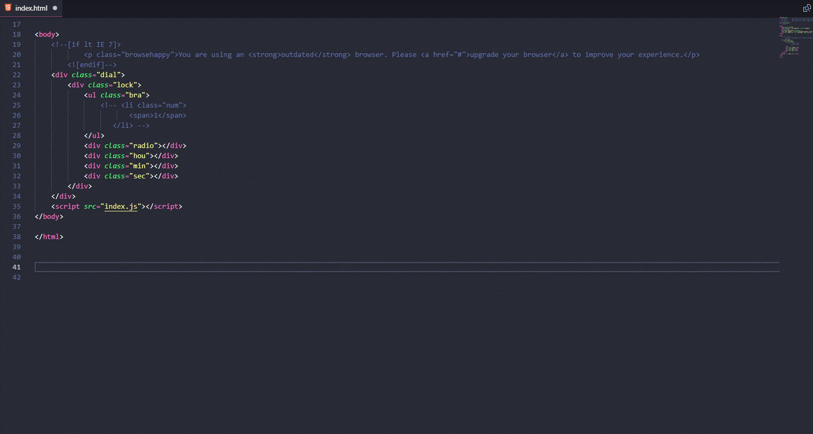

先来看张图，不得不说很强





# 元素
### 1、div 元素 按下div+table试一试吧
```
<div></div>
```


### 2、div>ul 子元素>
```
<div>

<ul></ul>

</div>
```


### 3、div+ul 同级元素+
```
<div></div>

<ul></ul>
```


### 4、div+div>p>span^em 向上^<div></div>
```
<div>

<p><span></span></p>

<em></em>

</div>
```


### 5、ul>li*5 元素输出次数
```
<ul>

<li></li>

<li></li>

<li></li>

<li></li>

<li></li>

</ul>
```


### 6、div>(header>ul>li*2>a)+footer>p grouping
```
<div>

<header>

<ul>

<li><a href=""></a></li>

<li><a href=""></a></li>

</ul>

</header>

<footer>

<p></p>

</footer>

</div>
```
####6.2 如下输出
```
(div>dl>(dt+dd)*3)+footer>p

<div>

<dl>

<dt></dt>

<dd></dd>

<dt></dt>

<dd></dd>

<dt></dt>

<dd></dd>

</dl>

</div>

<footer>

<p></p>

</footer>
```
* 使用组 你可以写下整页的标记 请不要这样做 官方给的建议 你可以尝试


# 属性运算符

### 1、div#id
```
<div id="id"></div>
```

### 2、div.class
```
<div class="class"></div>
```


# 自定义运算符

### 1、div[title='helloworld']
```
<div title="helloworld"></div>
```

### 2、div[title self]
```
<div title="" self=""></div>
```


# 编号 $

### 1、li.item$*5
```
<ul>

<li class="item1"></li>

<li class="item2"></li>

<li class="item3"></li>

<li class="item4"></li>

<li class="item5"></li>

</ul>
```
### 2、ul>li.item$$$*5
```
<ul>

<li class="item001"></li>

<li class="item002"></li>

<li class="item003"></li>

<li class="item004"></li>

<li class="item005"></li>

</ul>
```
### 3、ul>li.item$@-*5
```
<ul>

<li class="item5"></li>

<li class="item4"></li>

<li class="item3"></li>

<li class="item2"></li>

<li class="item1"></li>

</ul>
```


### 4、ul>li.item$@3*5
```
<ul>

<li class="item3"></li>

<li class="item4"></li>

<li class="item5"></li>

<li class="item6"></li>

<li class="item7"></li>

</ul>
```
### 5、ul>li.item$@-3*5
```
<ul>

<li class="item7"></li>

<li class="item6"></li>

<li class="item5"></li>

<li class="item4"></li>

<li class="item3"></li>

</ul>
```


# 文本{}

### 1、简单文本
```
<div>cs</div>
```
### 2、如下所示
```
a{click}+b{here}

<a href="">click</a><b>here</b>
```
  

### 3、如下所示
```
a>{click}+b{here}

<a href="">click<b>here</b></a>
```
### 4、如下所示
 ```
p>{Click }+a{here}+{ to continue}

<p>Click <a href="">here</a> to continue</p>
```