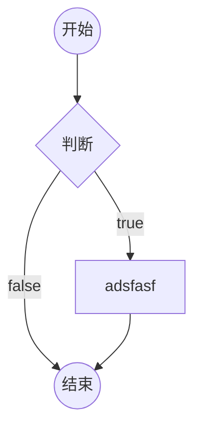
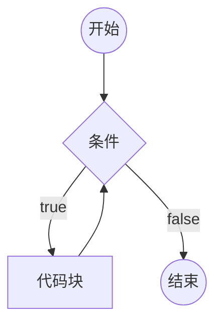
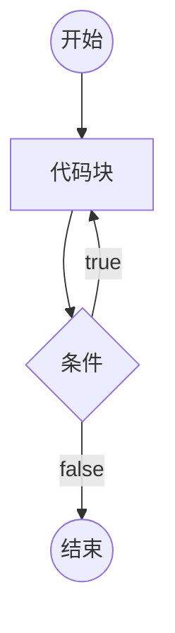
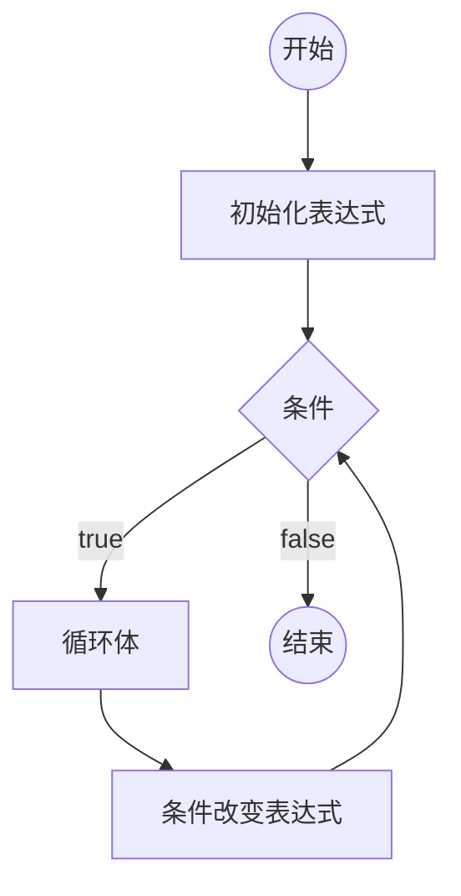

# JS语言概述、

## JS语言简史

1. JS语言的起源

网景（Netscape Communication Corperation），1994年，推出第一款商用浏览器，网景浏览器（Netscape Navigator）

1995年，网景公司决定在浏览器中加入一门语言，可以作交互效果，提高用户体验。

最终决定独立开发一门新的语言，聘请Brendan Eich，10天后，新的语言诞生

LiveScript -> JavaScript (JS)

**JS语言之父：Brendan Eich**

2. 第一次浏览器大战

网景公司打算在浏览器中加入网络操作系统，影响到微软的利益，引起了微软的注意

1995年，微软发布IE浏览器。

JS语言推出之后，网景获得极大的竞争优势。

微软对JS语言反编译，借鉴JS语言，退出了JScript、VBScript

第一次浏览器大战是标准之争

1997，网景公司将javascript1.1版本提交给ECMA（欧洲计算机制造协会）

IE3发布，并绑定windows操作系统。

1998年，网景公司，被收购。

**ECMA收录了JavaScript，并提交给ISO，经过修改，成为了第一个JS的标准版本，成为ECMAScript，简称ES**

3. 第二次浏览器大战

IE4、IE5、IE6（windows xp）

微软决定解散浏览器团队。

Brendan Eich，带领团队成立Mozilla基金会，并决定，将网景浏览器开源。

长时间内，世界的技术爱好者，对网景浏览器，进行维护和打补丁

2002，Mozilla推出firefox浏览器。

2008，谷歌推出chrome浏览器，苹果推出safari，ASA公司推出opera

chrome浏览器搭载JS执行引擎V8（V8引擎，可以将JS代码直接转换为字节码，理论上，JS代码的执行速度已经接近汇编语言）

于是，JS具备了编写大型应用程序的能力，甚至服务器应用

> Ryan Dahl 准备写一个服务器端的框架，直接利用V8引擎完成了该框架，该框架，称为nodejs

**V8，将JS的执行推向了一个新的台阶**

4. ES标准的发展

ES1，1997年
ES2，1998年
ES3，1999年
ES5，2009年，习惯上，不再区分 javascript （JS） 和 ECMAScript （ES）
ES6，2015年，ECMA宣布，从ES6开始，使用年号作为版本号，ES6的真正称呼为：ES2015
ES7，2016年，ES2016

**非常重要：ES制定语言标准，不涉及语言的运行环境。正是因为ES避免了运行环境，就让ES有机会在各种环境中执行。ES称为了通用编程语言**

**本课程学习的是，ES的通用语法、浏览器环境为其注入的新功能**

**通常，把ES运行的环境称之为，宿主环境**


## JS语言特性

- 解释型语言

编译型语言：C语言、C++、java语言、C#语言

编译型语言会经过一个翻译的过程，负责翻译的叫做编译器，翻译的结果，叫做编译结果。

优点：执行速度快
缺点：某个编译结果，难以适用于各种环境（跨平台障碍）；部署繁琐；

解释型语言：js、php

解释型语言没有编译结果

优点：跨平台；部署简单；
缺点：执行速度稍慢  

- 弱类型语言

弱类型：存放的数据类型可变。优点：灵活、易上手； 缺点：不严谨

强类型：存放的数据类型不可变。优点：严谨；缺点：不灵活、不易上手

> 通常，将弱类型的解释型语言，称为脚本语言

- 单线程

同步现象：上一件事情没有做完，下一件事情必须等待。

- 异步

提高单线程的执行效率。

# 第一个JS程序

## 浏览器环境中，代码书写位置

1. 直接书写到页面中的script元素的内部
2. 书写到外部的js文件，在页面中引用 [推荐]

代码分离：内容、样式、功能，三者分离，更加容易维护和阅读

- 页面中，可以存在多个script元素，执行顺序从上到下
- 如果一个script元素引用了外部文件，内部不能书写任何代码
- script元素有一个可选的属性，type，该属性用于指定代码的类型，该属性值是MIME格式

## 认识基本语法

- 语法部分必须都是英文符号
- js代码由多条语句构成，每个语句用英文分号结束（并非强制要求）
- js代码从上到下同步执行
- js语言大小写敏感

## 认识输出语句

所有的输出语句都不是ES标准。

- document.write，该语句用于将数据输出到页面
- alert，该语句用于将数据用弹窗的形式显示到页面
- console.log，该语句用于将数据显示到控制台

## 认识输入语句

所有的输入语句都不是ES标准

```html

prompt('请输入你的年龄')

```
## 认识注释

注释：提供给代码阅读者使用，不会参与执行

1. 单行注释  //
2. 多行注释  /*   */

在VSCode中，使用快捷键 ctrl + /，可以快速添加和取消单行注释
使用快捷键 alt + shift + a，可以快速添加和取消多行注释

# 数据和数据类型

数据：有用的信息

数据类型：数据的分类

本节课学习的是：不同类型的数据的字面量表示法

## JS中的数据类型

学习JS中，不同数据类型的数据的书写方式

### 原始类型(基本类型)

原始类型指不可再细分的类型

1. 数字类型 number

直接书写即可

> 了解：
> 数字类型可以加上前缀，来表示不同的进制
> 0：表示8进制
> 0x：表示16进制
> 0b: 表示2进制

2. 字符串类型 string

字符串：一长串文本（0个或多个）

- 单引号 '
- 双引号 "
- 飘，`，叫做模板字符串

在字符串中，如何表示一个特殊字符，可以使用转义符（\）

3. 布尔类型 boolean

布尔类型用于表达真或假两种状态

- true，表示真
- false，表示假

即除 false、0、""、null、undefined 和 NaN 以外皆为真值

1. undefined类型

表示未定义，不存在。

只有一种数据书写方式：undefined

5. null类型

表示空，不存在。

只有一种数据书写方式：null


> 区分某些长数字和字符串: 如果按照数字的方式阅读，则使用数字类型；否则使用字符串类型

### 引用类型

引用类型有两种：

- 对象 object （事物，东西，玩意儿）

可以认为，对象，是由多个基本类型组合而成。

书写对象的格式见 test6.html

**属性**：对象的成员

- 函数（后续章节专门讲解）


## 得到数据的类型

在数据前加上 typeof 

> js的bug（特征）： typeof null，得到的是object

## 字面量

直接书写的具体的数据，叫做**字面量**

# 变量

## 什么是变量

变量是一块内存空间，用于保存数据

> 计算机：CPU、内存、硬盘、输入输出设备
> 内存：存取速度快，数据易丢失
> 硬盘：存取速度慢，数据永久保存
> 计算机程序的运行，仅与内存打交道

## 如何使用变量

1. 声明（定义）变量

```js
var 变量名;
```

**变量声明后，它的值为undefined**

2. 给变量赋值

向变量的内存空间中存放数据


- 变量的值是可变的

变量可以被重新赋值，新的值会覆盖原来的值

- 变量的名称

在开发中，凡是需要自行命名的位置，叫做标识符

标识符的规范：

1)  [必]只能以英文字母、下划线、$开头
2)  [必]其他位置可以出现数字、英文字母、下划线、$
3)  [必]不可以与关键字、保留词重复
4)  [选]标识符应该做到望文知义
5)  [选]如果有多个单词，使用驼峰命名法，单词首字母大写

> 大驼峰：每个单词首字母大写
> 小驼峰：除第一个单词外，首字母大写
> 目前，使用的标识符都是小驼峰命名法。

> 宽度：width，高度：height，区域：area （quyu）

- 声明和赋值合并

变量的声明和赋值可以一条语句书写。

这是语法糖。

语法糖仅仅是为了方便代码书写或记忆，并不会有实质性的改变。

- 多个变量可以合并声明并赋值

语法糖

- **任何可以书写数据的地方，都可以书写变量**

- 若使用一个未声明的变量，会导致错误

例外：使用typeof得到类型时，可以是未声明的变量，得到的结果是undefined

- **JS中存在变量提升**

所有变量的声明，会自动的提到代码的最顶部

但是，这种提升，不会超越脚本块。

- JS中允许定义多个同名变量

同名变量，提升后会变成一个。

# 变量和对象

原始类型：number、string、boolean、null、undefined

引用类型：object、function 函数

## 在变量中存放对象

1. 通过变量，读取对象中的某个属性

```js
变量名.属性名
```

**当读取的属性不存在时，会得到undefined**

**当读取属性的对象不存在（undefined 或 null）时，程序报错**

2. 通过变量，更改对象中的某个属性

**当赋值的属性不存在时，会添加属性**

3. 删除属性

```js
delete 变量名.属性名;
```

4. 属性表达式

给属性赋值，或读取属性时，可以使用下面的格式操作

```js
对象变量["属性名"]
```

- 某些属性名中包含特殊字符

实际上，JS对属性名的命名要求并不严格，属性可以是任何形式的名字

**属性的名字只能是字符串，如果你书写的是数字，会自动转换为字符串**


## 全局对象

JS大部分的宿主环境，都会提供一个特殊的对象，该对象可以直接在JS代码中访问，该对象叫做全局对象

在浏览器环境中，全局对象为window，表示整个窗口

全局对象中的所有属性，可以直接使用，而不需要写上全局对象名。

**开发者定义的所有变量，实际上，会成为window对象的属性。**

**如果变量没有被赋值，则该变量不会覆盖window对象上的同名属性。**


# 引用类型

原始类型 引用类型（对象、函数）

**原始类型的变量，存放的具体的值**

**引用类型的变量，存放的是内存地址**

**凡是出现对象字面量的位置，都一定在内存出现一个新的对象**

> 扩展知识：JS中的垃圾回收
> 垃圾回收器，会定期的发现内存中无法访问到的对象，该对象称之为垃圾，垃圾回收器会在合适的时间将其占用的内存释放。


# 运算符概述

## 操作符和操作数

操作符：运算符，参与运算的符号

操作数：参与运算的数据，也称之为“元”

操作符不一定只有一个符号

操作符出现在不同的位置，可能具有不同的含义

目前接触的操作符：

1. = : 赋值符号，将右边的数据赋值给左边
2. . : 访问符号，用于访问对象的属性
3. []: 访问符号，用于访问对象的属性
4. (): 函数调用

## 分类

按操作数数量区分：

1. 一元（目）运算符：()  .  []
2. 二元（目）运算符: +  -  / * % = 
3. 三元（目）运算符: ?:

功能区分：

1. 算术运算符（数学）
2. 比较运算符
3. 逻辑运算符
4. 位运算符
5. 其他

## 表达式

表达式 = 操作符 + 操作数

每个表达式都有一个运算结果，该结果叫做**返回值**，返回值的类型叫做**返回类型**

所有的表达式都可以当作数据使用。


目前学习的运算符的返回值和类型

1. =：该表达式，返回赋值的结果
2. .：属性访问表达式，返回的是属性的值
3. []：属性访问表达式，返回的是属性的值
4. ()：函数调用表达式，返回的结果取决于函数的运行
5. 如果是一个声明+赋值的表达式，返回结果为undefined。

console.log函数调用的返回结果为undefined


> chrome浏览器控制台的环境是REPL环境
> REPL：Read Eval Print Loop，读-执行-打印-循环
> 当直接在控制台书写代码时，除了运行代码之外，还会输出该表达式的返回值


# 算术运算符

数学运算符

1. + - * /
2. + -
3. %
4. ++ --
5. ** 幂

## 细节

1. 数字运算是不精确的

2. 除数为0

如果被除数是正数，得到结果 Infinity （正无穷）
如果被除数是负数，得到结果 -Infinity （负无穷）
如果被除数是0，得到结果 NaN （Not a Number，非数字）

> typeof函数返回类型为string
> isNaN函数，该函数用于判断一个数据是否是NaN，返回boolean
> isFinite函数，该函数用于判断一个数据是否是有限的，返回boolean

3. 求余

%，有的教程称之为求模

余数的符号，与被除数相同。


## 其他类型使用算术运算

1. 除加号之外的算术运算符

将原始类型转换为数字类型（自动完成转换），然后进行运算。

- boolean： true -> 1, false -> 0
- string: 如果字符串内部是一个正确的数字，直接变为数字，如果是一个非数字，则得到NaN（能识别Infinity，不能把字符串内部的东西当作表达式），如果字符串是一个空字符串（没有任何内容“”），转换为0. 字符串转换时，会忽略前后空格。
> NaN虽然是数字，但它和任何数字作任何运算，得到的结果都是NaN

- null：null -> 0
- undefined: undefined -> NaN

将对象类型先转换为字符串类型，然后再将该字符串转换为数字类型

对象类型 -> "[object Object]" -> NaN

2. 加号运算符

- 加号一边有字符串，含义变为字符串拼接

将另一边的其他类型，转换为字符串

数字 -> 数字字符串
boolean -> boolean字符串
null -> "null"
undefined -> "undefined"
对象 -> "[object Object]"

- 加号两边都没有字符串，但一边有对象，将对象转换为字符串，然后按照上面的规则进行

- 其他情况和上面的数学运算一致

练习1

```javascript

var temperature = 30;
var F = 9 / 5 * temperature + 32;
console.log(`摄氏温度${temperature}°，华氏温度${F}F`);

```

练习2

```javascript
var money = 100000, month = 12, rate = 4.3;//利率百分比
var interest = money * rate / 100 / 12 * month;
console.log(`利息为${interest}`);


```


# 自增和自减

## 基本功能

一元运算符

++：将某个变量的值自增1

--：将某个变量的值自减1

## 细节

### 自增自减表达式

x++: 将变量x自增1，得到的表达式的值是自增之前的值。
++x: 将变量x自增1，得到的表达式的值是自增之后的值。
x--: 将变量x自减1，得到的表达式的值是自减之前的值。
--x: 将变量x自减1，得到的表达式的值是自减之后的值。


### 优先级

从高到底依次是：

1. ++ --
2. * / %
3. + -

优先级的运算细节：

1. 从左到右依次查看
2. 如果遇到操作数，将数据的值直接取出
3. 如果遇到相邻的两个运算符，并且左边的运算符优先级大于等于右边的运算符，则直接运行左边的运算符。


# 比较运算符

大小比较：>   <    >=    <=
相等比较：==   !=   ===   !==

**比较运算符的返回类型：boolean**

**算术运算符的优先级高于比较运算符**

## 大小比较

### 细节

1. 两个字符串比较大小，比较的是字符串的字符编码。

2. 如果一个不是字符串，并且两个都是原始类型，将它们都转换为数字进行比较

'1' -> 1
'' -> 0
'   ' -> 0
'  a' -> NaN
'3.14' -> 3.14

NaN与任何数字比较，得到的结果都是false

Infinity比任何数字都大

-Infinity比任何数字都小

3. 如果其中一个是对象，将对象转换为原始类型然后，按照规则1或规则2进行比较

目前，对象转换为原始类型后，是字符串 "[object Object]"

## 相等比较

### == 和 != (相等比较 和 不相等比较)

==: 比较两个数据是否相等
!=: 比较两个数据是否不相等

**细节**

1. 两端的类型相同，直接比较两个数据本身是否相同（两个对象比较的地址）

2. 两端的类型不同

1). null 和 undefined， 它们之间相等， 和其他原始类型比较， 则不相等。
2). 其他原始类型，比较时先转换为数字，再进行比较
3). NaN与任何数字比较，都是false，包括自身
4). Infinity和-Infinity，自能和自身相等
5). 对象比较时，要先转换为原始类型后，再进行比较

**由于相等和不相等比较，对于不同类型的数据比较违反直觉，因此，通常我们不适用这种比较方式，而是使用更加接近直觉的严格相等和严格不相等比较**

### === 和 !== （严格相等 和 严格不相等）

=== ： 两端的数据和类型必须相同
!== ： 两端的数据或类型不相同

1. 两端类型相同，规则和相等比较一致。
2. 两端类型不同，为false。

数字规则：

1). NaN与任何数字比较，都是false，包括自身
2). Infinity和-Infinity，自身和自身相等

# 逻辑运算符

布尔运算符

## 与（并且）

符号：&&

书写方式： 表达式1 && 表达式2

1. 将表达式1 进行 boolean 判定

以下数据均判定为false：

1) null
2) undefined
3) false
4) NaN
5) ''
6) 0

其他数据全部为真

2. 如果表达式1的判定结果为假，则直接返回表达式1，而不执行表达式2；否则，返回表达式2的结果。 （短路规则）

## 或

符号：||

写法：表达式1 || 表达式2

1. 将表达式1 进行 boolean 判定

2. 如果表达式1为真，直接返回表达式1，不运行表达式2；否则，返回表达式2

## 非

符号：!

写法: !数据

一元运算符

将数据的boolean判定结果直接取反，非运算符一定返回boolean类型。

# 三目运算符

书写方式： 表达式1 ? 表达式2 : 表达式3

1. 对表达式1进行boolean判定
2. 如果判定结果为真，返回表达式2；否则，返回表达式3。


# 补充知识

## 模板字符串

大括号里面写的时js语法
```
`test${2+2}123`
```

## 类型转换不会影响原本的数据

## 复合的赋值运算符

+=  -=  /=  *=  %=  **=

## void 运算符

一元运算符

写法：

1. 普通写法： void 表达式  
2. 函数写法： void(表达式) 

运行表达式，然后返回undefined

## typeof 运算符

一元运算符

写法：

1. 普通写法： typeof 表达式 
2. 函数写法： typeof(表达式) 

typeof运算，返回表达式的类型，是一个字符串。

## 逗号运算符

写法：表达式1, 表达式2

依次运行两个表达式，返回表达式2

逗号运算符的优先级比赋值更低


```javascript

var x = 1;
x = x++ * 2, x++ * 2, x++ * 2;
console.log(x);

>>输出
4

var x = 1;
x = x++ * 2, x++ * 2, x++ * 2;
console.log(x);

>>输出
6

```


# 数字的存储

**在对精度要求很高的系统中，或要对小数的运算结果进行比较时，需要特别谨慎**
 
## 问题

1. JS中的小数运算是精确的吗？

不一定

2. JS中的整数运算是精确的吗？

不一定

3. JS中表示的整数是连续的吗？

不是，当JS的数字很大的时候，不再连续。

4. JS中表示的最大数字是多少？

最大连续整数：9007199254740991

5. JS中能表示的数字的有效位数是多少？

16 ~ 17


## 二进制

现实世界中：十进制，10个数字，逢十进一

计算机世界中：二进制，2个数字，逢二进一

二进制 -> 十进制

1101 -> $1*2^3 + 1*2^2 + 0*2^1 + 1*2^0 = 13$

11.01 -> $1*2^1 + 1*2^0 + 0*2^{-1} + 1*2^{-2} = 3.25$

十进制 -> 二进制

13 -> 1101

```
13 / 2  商 6    余  1
6  / 2  商 3    余  0
3  / 2  商 1    余  1
1  / 2  商 0    余  1
余数从下往上看
```

3.25 -> 11.01

整数部分一样

小数部分

```
0.25 * 2    0.5     整数部分：0
0.5  * 2    1.0     整数部分：1
整数部分从上往下看

```


# 位运算

将一个整数的二进制格式进行运算

js中，如果对一个数据进行位运算，它首先会将其转换为一个整数，并且按照32位的整数二进制排列

举例

```
2.7 -> 2 -> 0000 0000 0000 0000 0000 0000 0000 0010

NaN -> 0

Infinity -> 0

-Infinity -> 0
```

## 与运算

符号：&

写法：整数1 & 整数2

将两个整数每一位进行比较，如果都为1，结果为1，否则结果为0.

## 或运算

符号：|

写法：整数1 | 整数2

将两个整数每一位进行比较，如果都为0，结果为0，否则结果为1.

## 否（非）运算

符号：~

写法：~整数

将该整数按位取反

**负数的存储方式**

-1

真码：1000 0000 0000 0000 0000 0000 0000 0001
反码：1111 1111 1111 1111 1111 1111 1111 1110  真码取反
补码：1111 1111 1111 1111 1111 1111 1111 1111  反码加1  最终的存储方案

取反的快速运算：-数字 - 1

JS中最快速的取整的方式：``` ~~整数 ```


## 异或运算

符号：^

写法：数字1 ^ 数字2

将数字1和数字2按位比较，不同取1，相同取0

```javasript

//交换2个数字
var a = 5; b = 3;

//方式1
var tem = a;
a = b;
b = tem;

//方式2  只能用在数字
a = a + b;
b = a - b;  //b=a
a = a - b;  //a=b


//方式3
//a=101
//b=011
a = a ^ b;//110
b = a ^ b;//110 ^ 011 = 101
a = a ^ b;//110 ^ 101 = 011

```

## 应用场景

位的叠加（开关）


## 位移运算

左位移： <<

写法： 数字1 << 数字2   结果： 数字1 * 2 ^ 数字2

将数字1的二进制（除符号之外，左移动数字2的次数）

```javascript

1 << 2 
结果>>

4
```

右位移：>>

写法： 数字1 >> 数字2   结果： 整数(数字1 / 2 ^ 数字2)

```javascript

5 >> 2 

结果>>

1

```

全右位移：>>>

与右位移的区别，在于全右位移会导致符号位跟着位移。

# 求余和求模

% ：求余

x % y

1. 求余 x rem y:  x - n * y, n表示商取整（直接去掉小数，向0取整）

```js
x = 7, y = 3   x rem y = x - n * y = 7 - 2 * 3 = 1

n = x / y = 2.333333 ≈ 2
```

```js
x = 7, y = -3  

n = 7 / -3 = -2.33333 ≈ -2

x rem y = x - n * y = 7 - (-2)*(-3) = 7 - 6 = 1
```

```js
x = -7, y = 3  

n = -7 / 3 = -2.33333 ≈ -2

x rem y = x - n * y = -7 - (-2)*3 = -7 + 6 = -1
```


**余数和被除数的符号相同**

2. 求模 x mod y:  x - n * y, n表示商取整（向下取整）

```js
x = 7, y = -3

x mod y = x - n * y = 7 - (-3)*(-3) = 7 - 9 = -2

n = 7 / -3 = -2.3333 ≈ -3
```

```js
x = -7, y = 3

x mod y = x - n * y = -7 - (-3)*3 = -7 + 9 = 2

n = -7 / 3 = -2.3333 ≈ -3
```

**求模的符号与除数相同**

# 流程图

一套的标准的图形，用于描述程序的逻辑

通常流程图分析程序的流程

## 在 markdown 中画流程图


//定义类型和描述



# if判断

```js
if(条件1){
    // 代码块
}
else if(条件2){
    // 代码块
}
else if(条件3){
    // 代码块
}
//....
else{
    // 以上条件都不满足执行的代码块
}
```

1. 如果某个条件满足，则直接忽略后面的所有条件
2. else if 可以有多个（包含0个）
3. else可以有1个或0个
4. else可以换行，可以不换行
5. 如果代码块只有一条语句，可以省略花括号（不推荐）
6. if只能出现一次


## 补充

1. 用户输入: prompt("提示文本")

该表达式返回结果：

1. null：表示用户点击了取消
2. 用户输入的字符串：表示用户点击了确定，得到用户输入的结果

返回类型：null 或 字符串

2. 将字符串转换成数字：+字符串

3. 得到一个随机数

Math.random() 该表达式返回一个0~1之间的随机数字（无法取到1）


# switch 开关

switch的语法始终可以使用if结构替代。

```js
switch(表达式){
    case 数据1:
        代码块
    case 数据2:
        代码块
    //...
    default:
        代码块
}
```

1. 计算表达式的返回值，依次和case后面的数据进行严格相等的比较，如果某个相等，停止比较，然后运行其内部的代码块，再然后，依次运行之后的所有代码块。
2. 在case分支内部，使用break语句，可以立即停止switch结构。
3. default表示前面的所有case都不匹配时运行。可以省略


# 循环

重复的运行一段代码

JS支持3种循环结构：while循环、do-while循环、for循环

## while循环

```js
while(条件){
    代码块（循环体）
}
```



死循环：条件永远满足，永远无法退出循环。

## do-while循环

```js
do{
    循环体
} while(条件);
```




## for循环

```js
for(初始化表达式; 条件; 条件改变表达式){
    循环体
}
```




## 循环中的关键字

循环控制语句

- break; 跳出循环
- continue; 停止当前循环体，进入下一次循环。

## 循环练习

1. 打印直角三角行

```javascript
var r = 15;
for (var i = 1; i <= r; i++) {
    var str = "";
    for (var j = 0; j < i; j++) {
        str += "*";
    }
    console.log(str);
}

```
2. 打印等腰三角形

```javascript
var r = 15;
for (var i = 1; i <= r; i++) {
    var str = "";
    for (var j = 0; j < r - i; j++) {
        str += " ";
    }
    for (var j = 0; j < 2 * i - 1; j++) {
        str += "*"
    }
    console.log(str)
}
```

3. 乘法口诀

```javascript

for (var i = 1; i <= 9; i++) {
    var str = "";
    for (var j = 1; j <= i; j++) {
        str += `${i}*${j}=${i * j}\t`
    }
    console.log(str);
}

```

# 数组

数组用于存放多个数据

## 创建一个数组

1. new Array(长度)
长度，数组里面的数据总数，长度一定是一个非负整数

new Array(数据, 数据, 数据....)

创建一个数组，并初始化其每一项的值

数组项：数组其中的一项数据

2. [数据,数据,数据,....]

创建一个数据，并初始化其每一项的值

## 认识数组的本质

数组的本质是一个对象

- length属性：数组的长度，会自动变化，值为最大下标+1
- 数字字符串属性：叫做下标，也叫做索引，相当于数组中每个数据的编号，下标从0开始排列


连续下标的取值范围：0 ~ length -1，如果给length直接赋值，会导致数组可能被截断

实际开发中，不要给length赋值。


## 下标

通常情况下，下标是连续的。

下标不连续的数组，叫做稀松数组。

## 数组的常见操作

### 添加数组项

- 数组[长度] = 数据：向数组末尾添加一个数据
- 数组.push(数据): 向数组末尾添加一个数据
- 数组.unshift(数据)：向数组起始位置添加一个数据，会导致数组每一项的下标向后移动
- 数组.splice(下标, 0, 添加的数据): 从指定下标位置开始，删除0个，然后在该位置插入添加的数据，如果下标超过范围，则按照范围的边界进行处理。

push、unshift、splice可以添加多个数据


### 删除数据

- delete 数组[下标]: 这种做法不会导致数组其他的属性发生变化，因此，该做法会导致产生稀松数组，所以不推荐使用该做法。
- 数组.pop(): 删除数组的最后一项，该表达式返回最后一项的数据
- 数组.shift()：删除数组第一项，该表达式返回第一项的数据
- 数组.splice(下标, 删除的数量, 添加的数 据): 从指定下标位置开始，删除指定数量，然后在该位置插入添加的数据，如果下标超过范围，则按照范围的边界进行处理。返回一个新数组，该数组记录被删除的数据。
   
### 其他操作

- .slice(起始位置下标, 结束位置下标)
  
将起始位置到结束位置之间的数据拿出来，得到一个新的数组，该函数不会改变原数组；注意：结束下标取不到

下标可以写负数，如果是负数，则从数组的末尾开始计算。

如果不写结束下标，则直接取到末尾。

- 清空数组 

数组.splice(0, 数组.length)

数组.length = 0;

- .indexOf(数据)

查找数组中某一项的下标，从数组中依次查找对应的数据，查找时使用严格相等进行比较。找到第一个匹配的下标，返回。如果没有找到，则得到-1；

- .lastIndexOf(数据)

功能和indexOf类似，只是查找的是最后一个匹配的下标

- .fill(数组, 开始下标，结束下标) 

将数组从开始下标起，到数组的结束下标（取不到），填充为指定的数据

有长度的情况下填充


- 数组.join(septor)

按照septro连接数组每一项形成一个字符串


- 数组.contact(数组2)
  
将数组2的所有元素 拼接到 数组1 的末尾 产生一个新数组返回，该表达式不会对原数组造成影响


### 数组练习

1. 素数
```javascript
//一个数除了1和它自身不能被其他数整除,则该数是质数
var arr = [1, 2, 3, 4, 5];
for (var index in arr) {
    // 判断arr[index]是不是素数
    var isFind = false;
    for (var i = 2; i < arr[index] - 1; i++) {
        if (arr[index] % i === 0) {
            isFind = true;
            break;
        }
    }
    if (!isFind && arr[index] >= 2) {
        console.log(arr[index]);
    }
}

```

2. 斐波那契数列

```
//斐波那契数列 1,1,2,3,5,8,13,21
var len = 10;
var arr = [];
for (var i = 1; i <= len; i++) {
    if (i == 1 || i == 2) {
        arr[i] = 1
    } else {
        arr[i] = arr[i - 1] + arr[i - 2]
    }
}
console.log(arr);
```

3. 冒泡排序

```javascript
var nums = [23, 2, -34, 3563, 111];
for (var i = 1; i < nums.length; i++) {
    for (var j = 0; j < nums.length - i; j++) {
        if (nums[j] > nums[j + 1]) {
            var tem = nums[j];
            nums[j] = nums[j + 1]
            nums[j + 1] = tem
        }
    }
}
/*
第一次:排了4次，比较的位置0-3
2,23,-34,3563,111
2,-34,23,3563,111
2,-34,23,3563,111
2,-34,23,111,3563
...
...
*/


```


## 语法补充

### in关键字

判断某个属性在对象中是否存在

属性名 in 对象

### for-in  foreach 循环

```js
for(var prop in 对象){
    //循环体
}
```

取出对象的所有属性名，每次循环将其中一个属性名赋值给变量prop，运行循环体。

for循环for-in循环最大的区别:for循环可以循环到稀松数组项，for-in循环循环不到


# 原型和原型链

- 所有对象都是通过`new 函数`创建 这个函数叫构造函数
- 

  
- 所有的函数也是对象 通过`new Function 函数`来创建 Function是js引擎启动的时候放到内存中
  - 由于函数是对象，函数有属性.如Array.from、Number.isNaN
- 所有对象都是引用类型.


## 原型 prototype

所有函数都有一个属性:`prototype`,称之为函数原型


默认情况下,prototype是一个普通的Object对象

默认情况下,prototype中有一个属性,constructor,它也是一个对象,它指向构造函数本身


## 隐式原型 __proto__

所有的对象都有一个属性`__proto__`称之为隐式原型

默认情况下,隐式原型指向该对象构造函数的原型


当访问一个对象的成员时:

1. 看该对象自身是否拥有该成员,如果有直接使用
2. 原型链中依次查找是否拥有该成员,如果有直接使用

猴子补丁:在函数原型中加入成员,以增强对象的功能,会导致原型污染,使用需谨慎

## 原型链

默认情况下,我们有一个函数为A，那么对象`var a = new A();a.__proto__.__proto__.__proto__`如此构成一条链条,称为原型链

特殊点：

1. Function的``__proto__``指向自身的prototype
2. Object的prototype的``__proto__``指向null


## 练习题

```javascript

function User() {}
User.prototype.sayHello = function() {}

var u1 = new User();
var u2 = new User();

console.log(u1.sayHello === u2.sayHello); //true
console.log(User.prototype.constructor); //User function
console.log(User.prototype === Function.prototype); //false
console.log(User.__proto__ === Function.prototype); //true
console.log(User.__proto__ === Function.__proto__); //true
console.log(u1.__proto__ === u2.__proto__);  //true
console.log(u1.__proto__ === User.__proto__); //false
console.log(Function.__proto__ === Object.__proto__);//true
console.log(Function.prototype.__proto__ === Object.prototype.__proto__);//false 
console.log(Function.prototype.__proto__ === Object.prototype); //true

```


# 原型链的应用

## 基础方法

W3C不推荐直接使用系统成员``__proto__``,会有性能上的损失

关于静态方法和实例方法

1. 静态方法

直接在函数上申明，如

```javascript

function A(){}

A.sayHello=function(){}

A.sayHello();//调用

```

2. 实例方法

```javascript

function A(){}

A.prototype.sayHello=function(){}

var a = new A()

a..sayHello() //调用

```

**Object.getPrototypeOf(对象)**

获取对象的隐式原型

`使用`

```javascript

var obj = {};

Object.getPrototypeOf(obj)  === obj.__proto__

```

**Object.prototype.isPrototypeOf(对象)**

判断当前对象(this)是否在指定对象的原型链上

`使用`

```javascript

function A(){}

var obj = new A()

Object.prototype.isPrototypeOf(obj)

判断Object是不是在obj的原型链上

```

`使用`

**对象 instanceof 函数**

判断函数的原型是否在对象的原型链上


不推荐使用

```javascript

[] instanceof Array
//是否是真数组


```

**Object.create(对象)**

创建一个新对象，其隐式原型指向指定的对象


`使用`

```javascript
var obj = {};

obj = Object.create(Object.prototype)

创建一个对象 其隐式原型指向Object.prototype


var obj = Object.create(null)

obj的隐式原型为null

**是不是所有的对象原型链最终都是object**

**不是**


```

**Object.prototype.hasOwnProperty(属性名)**

判断一个对象**自身**是否拥有某个属性

**循环的时候筛选原型链上的对象，不会循环Object上的属性(由于属性描述符的原因)**


## 应用

**类数组转换为真数组**

```js
Array.prototype.slice.call(类数组);

[].slice.call(类数组) //这个方法会创建一个新数组
```

**实现继承**

默认情况下，所有构造函数的父类都是Object


示例如下

默认用户为User,有方法sayHello

```javascript
function User(firstName,lastName,age){
    this.firstName=firstName;
    this.lastName=lastName;
    this.age=age;
    this.fullName=this.firstName+''+this.lastName;
}
User.prototype.sayHello=function(){
    console.log(`大家好,我叫${this.fullName},今年${this.age}岁了`);
}
```

模型如下


现在有VIP用户,有方法upgrade

```javascript
function VIPUser(firstName, lastName, age, money) {
    User.call(this, firstName, lastName, age);
    this.money = money;
}

VIPUser.prototype.upgrade = function() {
    console.log(`使用了${100}元软妹币，升级了！`);
    this.money -= 100;
}
```

我们通过call减少了部分代码的重复,目前模型如下


VIPUser应该也是User的子类，这并不是我们想要的结构

实现如下

```javascript
function inherit(son, father) {
    //创建一个对象 该对象的隐式原型为father的原型
    son.prototype = Object.create(father.prototype);
}
```

到了现在我们让VIPUser成为了User的子类。观察User的原型，其中有constructor，并且指向User

我们的VIPUser没有constructor,那么我们下面来创建这个constructor

```javascript
function inherit(son, father) {
    //创建一个对象 该对象的隐式原型为father的原型
    son.prototype = Object.create(father.prototype);
    son.prototype.constructor = son;
}
```

到现在位置我们的VIPUser就已经继承了User了


有的时候我们为了操作方便会加一个uber(`super`保留字不可在用了)

```javascript
function inherit(son, father) {
    //创建一个对象 该对象的隐式原型为father的原型
    son.prototype = Object.create(father.prototype);
    son.prototype.constructor = son;
    son.prototype.uber=father.prototype;
    // son.prototype.uber= father  //老师用的写法
}
```

到现在为止我们就实现了一个继承,但是上面的create是ES5的写法，下面我实现一个兼容性的写法(`圣杯模式`)

圣杯模式

```javascript
function inherit(son,father){
    var Temp = function(){}
    Temp.prototype=father.prototype;
    son.prototype = new Temp();
    son.prototype.constructor=son;
    son.prototype.uber=father.prototype; 
}
```

对每次创建的Temp进行优化处理

```javascript
var inherit= (function(){
    var Temp = function(){}
    return function(son,father){
        Temp.prototype=father.prototype;
        son.prototype = new Temp();
        son.prototype.constructor=son;
        son.prototype.uber=father.prototype; 
    }
})()

```

# 执行上下文

执行上下文:一个函数运行前,创建的一块内存空间.空间中包含有该函数所需要的数据,为该函数提供支持

执行上下文栈:call stack,所有执行上下文组成的内存空间

栈:先进后出  入栈(push) 出栈(pop)  栈底  栈顶

全局执行上下文:所有js代码执行之前,都必须有该环境

JS引擎始终执行的是栈顶的上下文。


## 执行上下文中的内容

1. this指向

1). 直接调用函数,this指向全局
2). 在函数外,this指向全局对象
3). 通过对象调用或new一个函数,this指向调用的对象或新对象


2. VO变量对象

variable Object: VO中记录了该环境中所有声明的参数、变量和函数

Global Object: GO，全局执行上下文中的VO

Active Object：AO，当前正在执行的上下文中的VO


1). 确定所有形参值以及特殊变量arguments
2). 确定函数中通过var声明的变量，将它们的值设置为undefined，如果VO中已有该名称，则直接忽略。
3). 确定函数中通过字面量声明的函数，将它们的值设置为指向函数对象，如果VO中已存在该名称，则覆盖。

当一个上下文中的代码执行的时候，如果上下文中不存在某个属性，则会从之前的上下文寻找。


# 作用域链

1. VO中包含一个额外的属性，该属性指向创建该VO的函数本身
2. 每个函数在创建时，会有一个隐藏属性``[[scope]]``，它指向创建该函数时的AO
3. 当访问一个变量时，会先查找自身VO中是否存在，如果不存在，则依次查找``[[scope]]``属性。

某些浏览器会优化作用域链，函数的``[[scope]]``中仅保留需要用到的数据。 


# 事件循环

JS运行的环境称之为宿主环境。

执行栈：call stack，一个数据结构，用于存放各种函数的执行环境，每一个函数执行之前，它的相关信息会加入到执行栈。函数调用之前，创建执行环境，然后加入到执行栈；函数调用之后，销毁执行环境。

JS引擎永远执行的是执行栈的最顶部。

异步函数：某些函数不会立即执行，需要等到某个时机到达后才会执行，这样的函数称之为异步函数。比如事件处理函数。异步函数的执行时机，会被宿主环境控制。

js语言设计的一个很重要的点是,js是没有多线程的.js引擎的执行是单线程执行.这个特性曾经困扰我很久,我想不明白既然js是单线程的,那么是谁来为定时器计时的?是谁来发送ajax请求的?我陷入了一个盲区.即将js等同于浏览器.我们习惯了在浏览器里面执行代码,却忽略了浏览器本身.js引擎是单线程的,可是浏览器却可以是多线程的,js引擎只是浏览器的一个线程而已.定时器计时,网络请求,浏览器渲染等等.都是由不同的线程去完成的. 

浏览器的线程：

1. JS执行引擎：负责执行JS代码
2. 渲染线程：负责渲染页面
3. 计时器线程：负责计时
4. 事件监听线程：负责监听事件
5. http网络线程：负责网络通信

事件队列：一块内存空间，用于存放执行时机到达的异步函数。当JS引擎空闲（执行栈没有可执行的上下文），它会从事件队列中拿出第一个函数执行。

当上面的线程发生了某些事请，如果该线程发现，这件事情有处理程序，它会将该处理程序加入一个叫做事件队列的内存。当JS引擎发现，执行栈中已经没有了任何内容后，会将事件队列中的第一个函数加入到执行栈中执行。

JS引擎对事件队列的取出执行方式，以及与宿主环境的配合，称之为事件循环。

事件循环：event loop，是指函数在执行栈、宿主线程、事件队列中的循环移动。

事件队列在不同的宿主环境中有所差异，大部分宿主环境会将事件队列进行细分。在浏览器中，事件队列分为两种：

- 宏任务（队列）：macroTask，计时器结束的回调、事件回调、http回调等等绝大部分异步函数进入宏队列
- 微任务（队列）：MutationObserver，Promise产生的回调进入微队列

> MutationObserver用于监听某个DOM对象的变化
```js
let count = 1;
const ul = document.getElementById("container");
document.getElementById("btn").onclick = function () {
    setTimeout(() => {
        console.log('添加了一个li');
    }, 0);//宏队列
    var li = document.createElement("li");
    li.innerText = count++;
    ul.appendChild(li);
}
const observer = new MutationObserver(function B() {
    console.log('ul元素发生了变化');//微队列
});
observer.observe(ul, {
    attributes: true,//监听属性的变化
    childList: true,//监听子元素的变化
    subtree: true //监听子树的变化
})
```

当执行栈清空时，JS引擎首先会将微任务中的所有任务依次执行结束，如果没有微任务，则执行宏任务。


**一个简单的例子**
```js
var isEnd = true;
window.setTimeout(function () {
    isEnd = false;//1s后，改变isEnd的值
}, 1000);
while (isEnd);
alert('end');
//alert 永远不会执行
```
## js引擎与GUI引擎是互斥的

谈到这里,就不得不说浏览器的另外一个引擎---GUI渲染引擎. 在js中渲染操作也是异步的.比如dom操作的代码会在事件队列中生成一个任务,js执行到这个任务时就会去调用GUI引擎渲染.

js语言设定js引擎与GUI引擎是互斥的,也就是说GUI引擎在渲染时会阻塞js引擎计算.原因很简单,如果在GUI渲染的时候,js改变了dom,那么就会造成渲染不同步. 我们需要深刻理解js引擎与GUI引擎的关系,因为这与我们平时开发息息相关,我们时长会遇到一些很奇葩的渲染问题.看这个例子

```js
//html
<table border=1>
    <tr><td><button id='do'>Do long calc - bad status!</button></td>
        <td><div id='status'>Not Calculating yet.</div></td>
    </tr>
    <tr><td><button id='do_ok'>Do long calc - good status!</button></td>
        <td><div id='status_ok'>Not Calculating yet.</div></td>
    </tr>
</table>  
//js
function long_running(status_div) {

    var result = 0;
    for (var i = 0; i < 1000; i++) {
        for (var j = 0; j < 700; j++) {
            for (var k = 0; k < 300; k++) {
                result = result + i + j + k;
            }
        }
    }
    document.querySelector(status_div).innerHTML = 'calclation done' ;
}

document.querySelector('#do').onclick = function () {
    document.querySelector('#status').innerHTML = 'calculating....';
    long_running('#status');
};

document.querySelector('#do_ok').onclick = function () {
    document.querySelector('#status_ok').innerHTML = 'calculating....';
    window.setTimeout(function (){ long_running('#status_ok') }, 0);
};
```

# 对象混合和对象克隆

## 对象混合


```javascript
/**
 * obj2混合到obj1产生新的对象
 */
 function mixin=function(obj1,obj2){
     //第一个参数写{}原因,这个函数是后一个函数复制到前一个函数上,返回结果和obj1相同,所以写{}
     return Object.assign({},obj1,obj2);
     
    //  var newObj={};
    //  for(var prop in obj2){
    //      newObj[prop]=obj2[prop]
    //  }

    //  for(var prop in obj1){
    //      if(!prop in obj1){
    //          newObj[prop]=obj1[prop]
    //      }
    //  }
    //  return newObj;
 }

```

## 对象克隆


```javascript
/**
 * 克隆一个对象
 * @param {boolean} deep 是否深度克隆
 */

 function clone(obj,deep){
     if(Array.isArray(obj)){
         if(deep){
             var newArr=[];
             for(var i = 0;i<obj.length;i++){
                 newArr.push(this.clone(obj[i],deep));
             }

         }else{
             return obj.slice();
         }
     }else if(typeof(obj) === "object"){
         var newObj={};
         for(var prop in obj){
             if(deep){
                 newObj[prop] = this.clone(obj[prop],deep);
             }else{
                 newObj[prop]=obj[prop]
             }
         }
         return newObj;
     }else{
         return obj;
     }
 }

```

# 函数防抖和节流

在前端开发中有一部分的用户行为会频繁的触发事件执行，而对于DOM操作、资源加载等耗费性能的处理，很可能导致界面卡顿，甚至浏览器的崩溃。函数节流(throttle)和函数防抖(debounce)就是为了解决类似需求应运而生的

## 节流

函数节流就是预定一个函数只有在大于等于执行周期时才执行，周期内调用不执行。好像水滴攒到一定重量才会落下一样

```javascript
function throttle=function(callback,time,immediately){
    if(immediately){
        immediately=true;
    }
    if(immediately){
        var t;
        if(!t  || Date.now()-t >= time){
            callback.apply(null,arguments);
            t=Date.now();
        }
    }else{
        var timer;
        if(timer){
            return;
        }
        var args=arguments;
        timer=setTimeout(function(){
            callback.apply(null,args);
            timer=null;
        },time)
    }
}
```

## 防抖

函数防抖就是在函数需要频繁触发的情况时,只有足够空闲的时间,才执行一次.

```javascript
function debounce(handle,delay){
    var timer=null;
    return function(){
        var _self=this,_arg=arguments;
        clearTimeout(timer);
        timer=setTimeout(function(){
            handler.apply(_self,_arg);
        },delay)
    }
}
```

