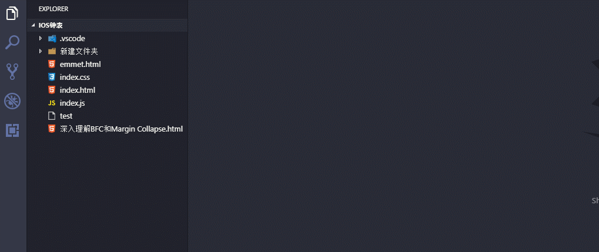
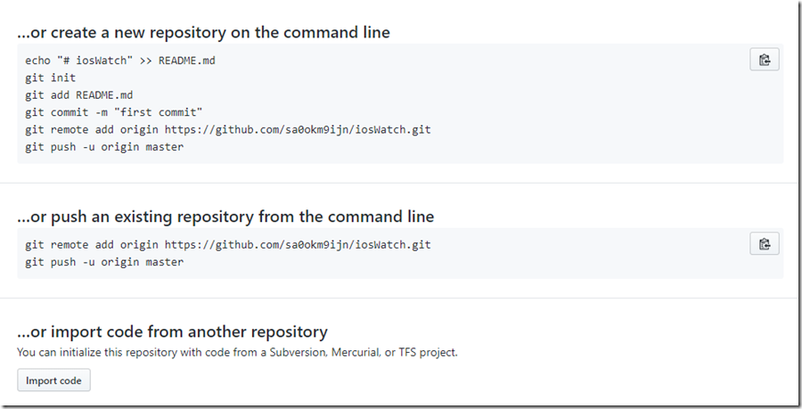
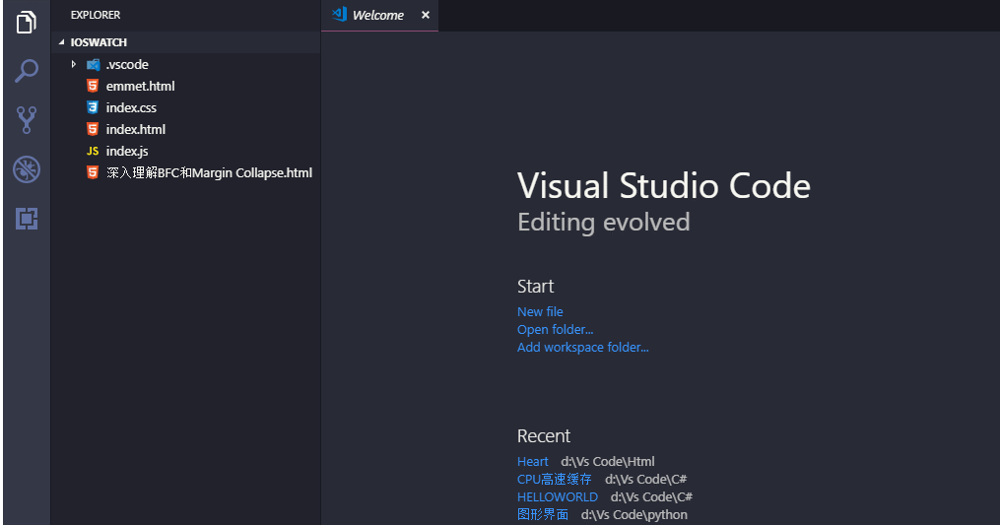

# 下载以及安装软件

1、首先需要创建一个Git账号，<https://github.com/join?source=experiment-header-dropdowns-home>，此教程默认已经注册好了Git账号,此处不再阐述注册过程

2、下载适合自己电脑系统的git,<https://git-scm.com>,下载完成后，正常软件安装，下一步。。。安装完成。安装完成之后鼠标右键会出现，gitbash等快捷项。

# Git初始化配置

1、因为Git是分布式版本控制系统，所以，每个机器都必须自报家门：你的名字和Email地址。右键点击gitbash，键入命令
```
git config --global user.name "您的名称"

git config --global user.emal "您的邮箱"
```
设置完成之后，查看设置
```
git config user.name

git config user.email
```
2、由于本地Git仓库和GitHub仓库之间的传输是通过SSH加密的，所以必须要让github仓库认证你SSH key，在此之前，必须要生成SSH
key。键入命令
```
ssh-keygen -t rsa -C [youremail@example.com](mailto:youremail@example.com)
```
密钥类型可以用 -t
选项指定。如果没有指定则默认生成用于SSH-2的RSA密钥。这里使用的是rsa。然后会要求输入保存key的文件名，输入即可。后面两次要求输入密码。可为空

此时`[c盘>用户>自己的用户名>.ssh]`目录下已经生成好了。可以到目录下面看到2葛文件分别id_rsa和id_rsa.pub。对应私钥文件和公钥文件。

每次代码的提交，服务器都会用你的私钥提交服务器，公钥进行验证。由于使用的是不对称加密，所以公钥可以公开，只要保管好私钥就可以。

3、拷贝公钥

打开[c盘>用户>自己的用户名>.ssh>id_rsa.pub]拷贝公钥.打开<https://github.com/settings/keys>，把公钥添加进去，并给一个title用来区分其他的公钥。

4、测试ssh的连接，键入命令
```
ssh -T ``[git@github.com](mailto:git@github.com)`
```
出现下面提示，证明你连接成功了!`
```
Hi sa0okm9ijn! You've successfully authenticated, but GitHub does not provide
shell access. `
```
到了这里git的初始化配置就算完成了`

# 本地仓库建立

找到你程序所在的目录，键入命令
```
git init
```
这个目录就是git所说的仓库了，这时候用VsCode打开这个目录,增加一个文件，然后会看到左侧SourceControl图标变化，点击然后点文件上的+再点最上方的对号，对应的就是git
```
add ----->  git commit
``` 

[](一步一步把本地目录放到git仓库/584421-20181228144816706-1387115110.gif)

现在我们本地仓库也建好了，也可以在本地不停的修改和提交了，不过貌似都是一个人在玩 ，没意思额 一个项目说的是协同合作，好吧
我们现在把我们的仓库和服务器仓库联系起来

打开<https://github.com/new>，键入仓库名称 直接创建即可，创建完成如图

[](一步一步把本地目录放到git仓库/584421-20181228144817968-1184424927.png)

大概意思就是可以创建一个新的仓库然后关联到服务器上的存储库

直接推送服务器仓库

另一个存储库导入

我们的符合第一个情况

关联服务器仓库，键入命令
```
git remote add origin
[https://github.com/sa0okm9ijn/iosWatch.git](https://github.com/sa0okm9ijn/iosWatch.git)

git push -u origin master
```
关联远程仓库，并把本地信息推送，注意上面连接地址要替换成自己  不然会失败，我的上面没有你们的key。

此时去看服务器仓库 ，已经由了本地仓库的文件,此刻我们在添加一个文件，再提交，再从暂存区提交到代码库如下图

[](一步一步把本地目录放到git仓库/584421-20181228144818946-1497660752.gif)

此刻再刷新服务器仓库，可以看到仓库里面有了我们提交的文件。到现在我们已经完成了本地仓库和服务器仓库的关联，并且可以做一些提交工作。

本文一个简单的配置，更多git的使用 还是需要更多的自己尝试。
