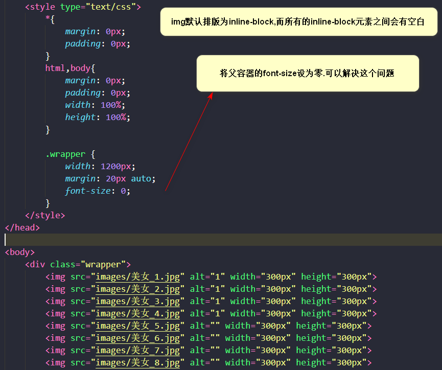
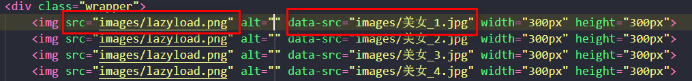
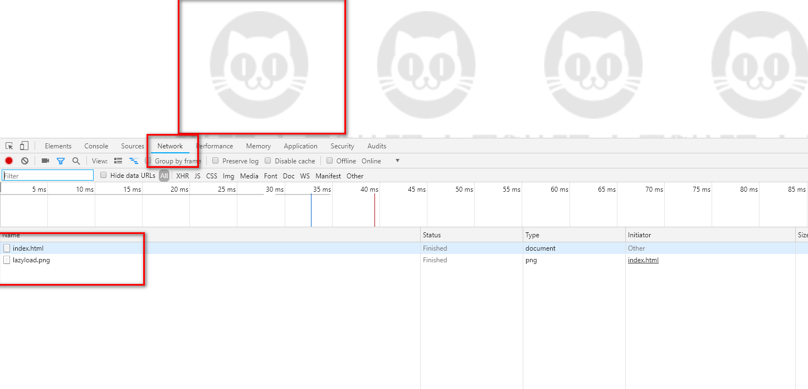
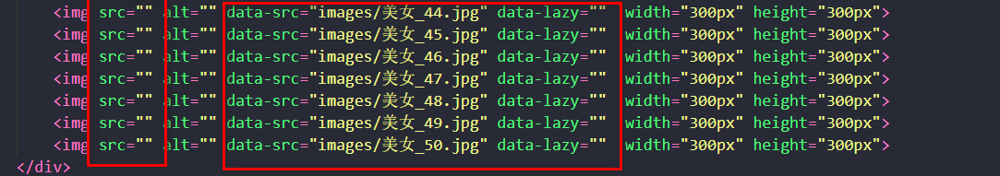

### 界面布局
* 首先我们布局一个简单的界面，如下



* 如图所式，我们有50张图片，依次放到界面上显示，此时我们打开浏览器，发现需要请求50次图片资源


* 这样的话，就会占用大量的带宽，网速不好的情况下，会有非常不好的体验，下面我们进行改造



* 我们用自定义属性data-src存储图片的真实地址，src存储的是正在加载的地址，此时我们打开浏览器



* 很明显看到我们的请求资源变为了一张图片，由于我们正在加载的图片为同一资源，浏览器的缓存技术，访问同一个资源，会请求一次，此时来看我们已经解决了访问资源过多的问题，下面我们就需要在需要的时候把我们真正的图片加载出来



* 上述代码我们先先进行简单的优化处理,默认等待图片由用户传入,添加data-lazy自定义属性，标记此标签需要懒加载

### js实现

* 我们首先获取需要懒加载的所有元素，并且转化为数组，然后设置默认等待图片
* 加载所有图片
* 判断每张图片是否在视口，然后加载
* 处理滚动条事件，加入防抖机制

```
function lazyLoad(defaultImg) {
    //1、获取需要懒加载的元素
    var imgs = document.querySelectorAll("[data-lazy]");
    //转换为数组
    imgs = Array.from(imgs);
    //2、设置默认图片
    setDefault();

    //3、加载图片
    loadImgs();

    //4、滚动条事件
    var timer;

    function onchange() {
        //每次onscroll进来如果上次的还没执行，则清空再次处理这次的滚动，防止抖动
        if (timer) {
            clearTimeout(timer);
        }
        timer = setTimeout(() => {
            loadImgs();
        }, 500);
    }

    //防抖
    document.onscroll = function () {
        onchange();
    }
    window.onresize = function () {
        onChange();
    }
    /**
     * 设置默认图片
     */
    function setDefault() {
        if (!defaultImg) {
            return;
        }
        for (var i = 0; i < imgs.length; i++) {
            var img = imgs[i];
            img.src = defaultImg;
        }
    }
    /**
     * 加载图片
     */
    function loadImgs() {
        for (var i = 0; i < imgs.length; i++) {
            var img = imgs[i];
            if (loadOneImg(img)) {
                //加载成功一张   下一次就不循环了  优化性能
                i--;
            }
        }
    }
    /**
     * 加载一张图片
     * @param {*} img 
     */
    function loadOneImg(img) {
        if (!isElementInViewport(img)) {
            return false;
        }
        var index = imgs.lastIndexOf(img);
        imgs.splice(index, 1);
        img.src = img.dataset.src;
        return true;
    }
    /**
    获取视口
    **/
    function getViewportOffset() {
        if (window.innerWidth) {
            return {
                w: window.innerWidth,
                h: window.innerHeight
            }
        } else {
            if (document.compatMode == "BackCompat") {
                return {
                    w: document.body.clientWidth,
                    h: document.body.clientHeight
                }
            } else {
                return {
                    w: document.documentElement.clientWidth,
                    h: document.documentElement.clientHeight
                }
            }
        }
    }

    function isElementInViewport(ele) {
        var vp = getViewportOffset();
        var rect = ele.getBoundingClientRect();
        console.log(rect);
        console.log(vp);
        //图片必须完全显示 出来 才加载
        // return (
        //     rect.top >= 0 &&
        //     rect.left >= 0 &&
        //     rect.bottom <= vp.h &&
        //     rect.right <= vp.w
        // );

        //图片元素只要有部分出来即可加载
        if (rect.bottom <= 0) {
            return false;
        }
        if (rect.top - vp.h >= 0) {
            return false;
        }
        return true;
    }
}
```

### 处理大图片

我们有时候网站上存在可能几兆的大图片，我们又不希望看到网页出现白白的一片，这时候我们就需要另外的一种解决方法，如下界面设置如下

```

<div class="bigimage">
```

* 添加自定义属性data-original,里面为大图片，data-src里面可以设置一个小图片，这是我们只需要给该图片load事件里，加载大图片，这样就会增强用户体验了，如下

```
//小图片加载完成，加载大图片，这样页面不会出现空白
img.onload = function () {
        //如果是大图片
        if (img.dataset.original) {
            img.src = img.dataset.original;
            img.onload = null;//防止不停出发load事件
        }
    }
```


