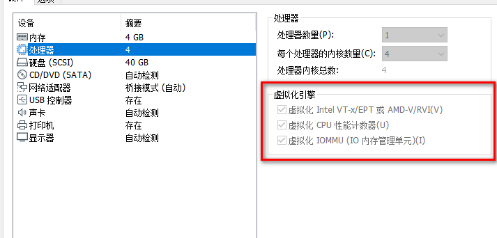
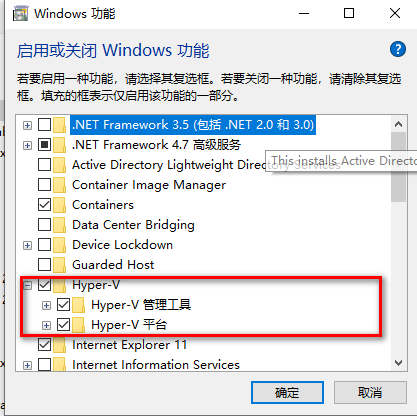
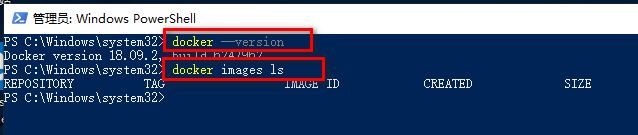

## 基本概念

适用于Windows的Docker Desktop是Docker，旨在在Windows 10上运行，Docker Desktop for
Windows使用Windows本机Hyper-V虚拟化和网络，是在Windows上开发Docker应用程序的最快，最可靠的方法。

本问旨在介绍window10上的docker安装。

1、vmware虚拟机安装window10 enterprise  64位，这里忽略虚拟机的安装。安装完成之后设置如下图所示

虚拟化引擎全部勾起来，类似于开启Windows本机Hyper-V虚拟化和网络，如果不是虚拟机的小伙伴可以如下图开启

2、下载[Docker Desktop for
Windows](https://hub.docker.com/editions/community/docker-ce-desktop-
windows)，安装即一步一步直到完成即可

3、安装完成右下角可以看到如下图标

4、打开windows Powershell,为了避免不必要的错误，用管理员那个吧。。。运行如下指令

如图docker已经安装完成。。。