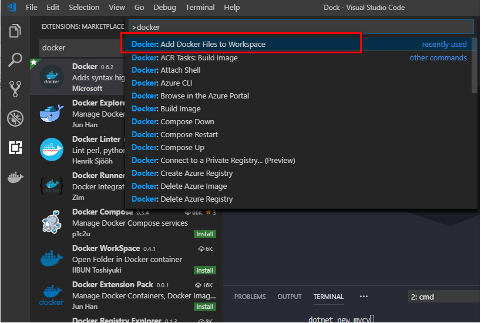
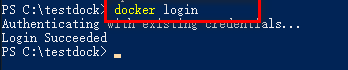
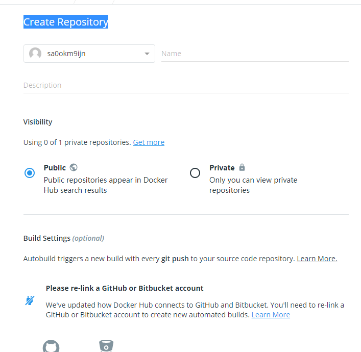
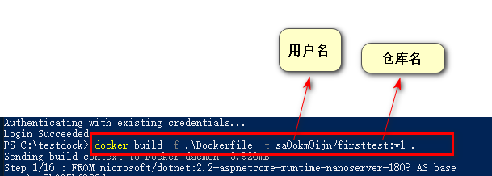
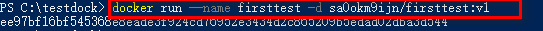
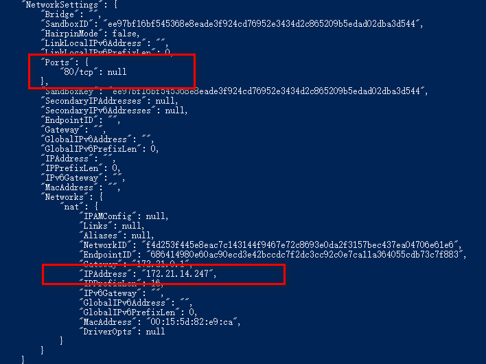
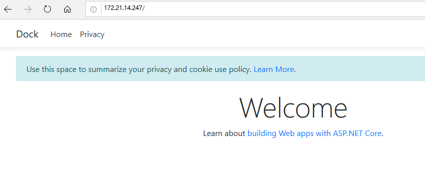
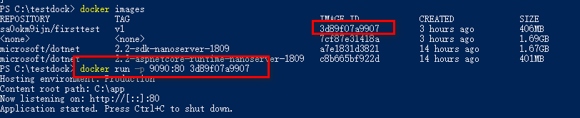
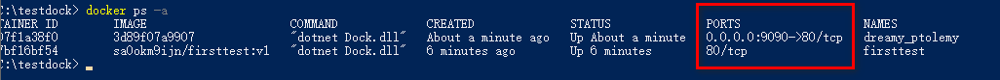
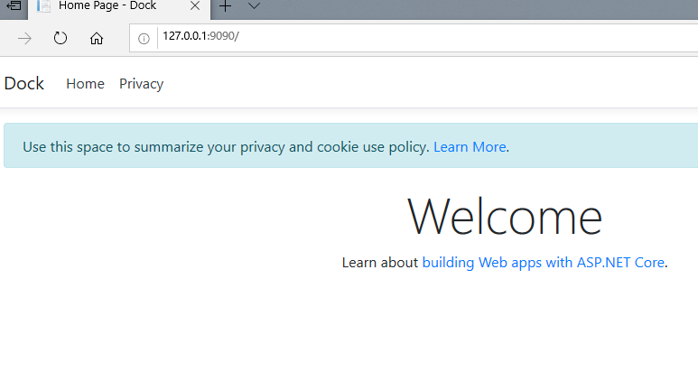

1、vscode控制台新建项目Dock,如下指令创建项目,关于.netcore创建项目不做详细介绍
```
dotnet new mvc
```
2、vscode 安装docker插件


3、vscode窗口键入F1，输入Docker.add Docker Files to Workspace---->接下来选择asp.net core



4、项目目录下会生成Dockfile文件

5、此时我们的docker已经启动，运行powershell，来构建我们的镜像

6、登录Docker,按照提示输入对应用户名和密码,我这里是之前登录过的，不需要再次输入,没有账号的，去[注册](https://hub.docker.com/signup?next=%2F%3Fref%3Dlogin)一个就可以.



7、注册完之后创建一个Repository



8、此时我们构建我们的.netcore项目镜像



9、此时查看我们的镜像


10、启动Docker



11、我们此次需要访问我们的网站，需要知道Docker的ip和端口，输入 docker inspect firsttest ,返回如下



12、此时我们访问，如下



13、好了我们现在可以在宿主机访问，docker部署asp-netcore/的网站了，此时我们外机访问却访问不了，如下我们可以做一个映射





14，此时访问宿主机ip可以看到如下效果




 15、至此我们的.nercore项目成功部署到docker,可以通过访问宿主机的ip，然后映射到docker的ip来实现访问。
